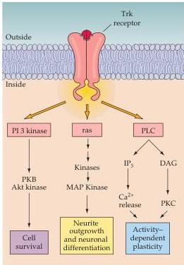
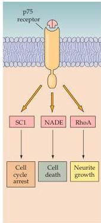

Construction of Neural Circuits 555

(A)

(B)
Figure 22.16 Signaling through the neurotrophins and their receptors.
(A) Signaling via Trk dimers can lead to a variety of cellular responses, depending on the intracellular signaling cascade engaged by the receptor after binding to the ligand.
The possibilities include cell survival (via the protein kinase C/AKT pathway); neurite growth (via the MAP-Kinase pathway); and activity-dependent plasticity (via the $\mathrm{Ca^{2+}}$/calmodulin and PKC pathways).
(B) Signaling via the p75 pathway can lead to neurite growth via interaction with Rho kinases, or cell cycle arrest and cell death via other distinct intracellular signaling cascades.

to retain them.
Fixed and/or diffusible adhesive, chemotropic, chemorepulsive, and trophic molecules all regulate the trajectory of growing axons and the synaptic connections they make with target cells.
These developmental interactions occur over weeks, months, and to some extent may continue at a low level over the entire lifetime of the animal—as body size and functional demands change.
Cell adhesion molecules influence the initial targeting of axons to appropriate target zones by modulating the direction and extent of growth cone motility.
The earliest effects of trophic agents are on cell survival and differentiation.
Once the appropriate number of neurons is established, trophic signals continue to govern the establishment of neural connections, particularly the extent of axonal and dendritic arborizations.
Defects in the early guidance of axons are responsible for a variety of congenital neurological syndromes, and conditions thought to reflect trophic dysfunction may underlie degenerative diseases such as amyotrophic lateral sclerosis and Parkinson's disease.
Understanding the molecular basis of axon guidance, synapse formation, and trophic signaling began a century ago and has now burgeoned into a broad effort that continues to identify additional factors and signaling pathways to illuminate their varied roles in both the developing and adult brain.
A further goal that now seems within reach is the application of this knowledge to understanding a spectrum of previously intractable neurological diseases.