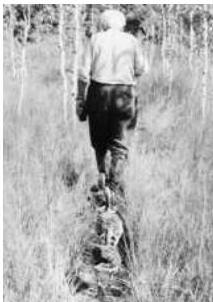

Chapter Twenty-Three

# Box A

## Built-In Behaviors

The idea that animals already possess a set of behaviors appropriate for a world not yet experienced has always been difficult to accept.
However, the preeminence of instinctual responses is obvious to any biologist who looks at what animals actually do.
Perhaps the most thoroughly studied examples occur in young birds.
Hatchlings emerge from the egg with an elaborate set of innate behaviors.
First, of course, is the complex behavior that allows the chick to escape from the egg.
Having emerged, a variety of additional abilities indicate how much early behavior is "preprogrammed" (see Box A in Chapter 30).

In a series of seminal observations, Konrad Lorenz, working with geese, showed that goslings follow the first large, moving object that they see and hear during their first day of life.
Although this object is normally the mother goose, Lorenz found that goslings can imprint on a wide range of animate and inanimate objects presented during this period, including Lorenz himself (see figure).
The window for imprinting in goslings is less than a day: If animals are not exposed to an appropriate stimulus during this time, they will never form the appropriate parental relationship.
Once imprinting occurs, however, it is irreversible, and geese will continue to follow inappropriate objects (male conspecifics, people, or even inanimate objects).
In many mammals, auditory and visual systems are poorly developed at birth, and maternal imprinting relies on olfactory and/or gustatory cues.
For example, during the first week of life (but not later), infant rats develop a lifelong preference to odors associated with their mother's nipples.
As in birds, this variety of filial imprinting also plays a role in their social development and later sexual preferences.

Imprinting is a two-way street, with parents (especially mothers) rapidly forming exclusive bonds with their offspring.
This phenomenon is especially important in animals like sheep that live in large groups or herds and produce offspring at about the same time of year.
Ewes have a critical period 2-4 hours after giving birth during which they imprint on the scent of their own lamb.
Following this time, they rebuff approaches by other lambs.

The relevance of this work to primates was underscored in the 1950s by Harry Harlow and his colleagues at the University of Wisconsin.
Harlow isolated monkeys within a few hours of birth and raised them in the absence of either a natural mother or a human substitute.
In the best-known of these experiments, the baby monkeys had one of two maternal surrogates: a "mother" constructed of a wooden frame covered with wire mesh that supported a nursing bottle, or a similarly shaped object covered with terrycloth.
When presented with this choice, the baby monkeys preferred the terrycloth mother and spent much of their time clinging to it, even if the feeding bottle was with the wire mother.
Harlow took this to mean that newborn monkeys have a built-in need for maternal care and have at least some innate idea of what a mother should be like.
More recently, a number of other endogenous behaviors have been carefully studied in infant monkeys, including a naive monkey's fear reaction to the presentation of certain objects (e.g., a snake) and the "looming" response (fear elicited by the rapid approach of any formidable object).
Most of these built-in behaviors have analogs in human infants.

Taken together, these observations make plain that many complicated behaviors, emotional responses, and other predilections are well established in the nervous system prior to any significant experience, and that the need for certain kinds of early experience for normal development is predetermined.
These built-in behaviors and their neural substrates have presumably evolved to give newborns a better chance of surviving in a predictably dangerous world.

## References

HARLOW, H.
F.
(1959) Love in infant monkeys.
Sci.
Amer.
2 (September): 68-74.
HARLOW, H.
F.
AND R.
R.
ZIMMERMAN (1959) Affectional responses in the infant monkey.
Science 130: 421-432.
LORENZ, K.
(1970) Studies in Animal and Human Behaviour.
Translated by R.
Martin.
Cambridge, MA: Harvard University Press.
MACFARLANE, A.
J.
(1975) Olfaction in the development of social preferences in the human neonate.
Ciba Found.
Symp.
33: 103-117.
SCHAAL, B.
E., H.
MONTAGNER, E.
HERTLING, D.
BOLZONI, A.
MOYSE AND R.
QUICHON (1980) Les stimulations olfactives dans les relations entre l'enfant et la mère.
Reprod.
Nutr.
Dev.
20(3b): 843-858.
TINBERGEN, N.
(1953) Curious Naturalists.
Garden City, NY: Doubleday.

Konrad Lorenz, followed by imprinted geese.
(Photograph courtesy of H.
Kacher.)