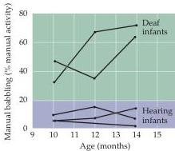

Modification of Brain Circuits as a Result of Experience 559

cific experiences during a sharply restricted time in early postnatal (or posthatching; see Box A) development.
On the other hand, critical periods for sensory and motor skills, or complex behaviors such as human language, are longer and much less well delimited.

Despite the fact that critical periods vary widely in both the behaviors affected and their duration, they all share some basic properties.
A critical period is defined as the time during which a given behavior is especially susceptible to, and indeed requires, specific environmental influences to develop normally.
Once this period ends, the behavior is largely unaffected by subsequent experience (or even by the complete absence of the relevant experience).
Conversely, failure to be exposed to appropriate stimuli during the critical period is difficult or in some cases impossible to remedy subsequently.

While psychologists and ethologists (biologists who study the natural behavior of animals) have long recognized that early postnatal or posthatching life is a period of special sensitivity to environmental influences, their studies of critical periods focused on behavior.
Work in the last few decades has increasingly examined the underlying changes in the relevant brain circuits and their mechanisms.

## The Development of Language: Example of a Human Critical Period

Many animals communicate by means of sound, and some (humans and songbirds are examples) learn these vocalizations.
There are, in fact, provocative similarities in the development of human language and birdsong (Box B).
Many other animal vocalizations, like alarm calls in mammals and birds, are innate, and require no experience to be correctly produced.
For example, quail raised in isolation or deafened at birth so that they never hear conspecifics nonetheless produce the full repertoire of species-specific vocalizations.
In contrast, humans obviously require extensive postnatal experience to produce and decode speech sounds that are the basis of language.
The various forms of early language exposure, including the "baby talk" that parents and other adults often use to communicate with children as they begin to acquire language may actually serve to emphasize important perceptual distinctions that facilitate proper language production and comprehension.

Importantly, this linguistic experience, to be effective, must occur in early life.
The requirement for perceiving and practicing language during a critical period is apparent in studies of language acquisition in congenitally deaf children.
Whereas most babies begin producing speechlike sounds at about 7 months (babbling), congenitally deaf infants show obvious deficits in their early vocalizations, and such individuals fail to develop language if not provided with an alternative form of symbolic expression (such as sign language; see Chapter 26).
If, however, these deaf children are exposed to sign language at an early age (from approximately six months onward), they begin to "babble" with their hands just as a hearing infant babbles audibly.
This suggests that, regardless of the modality, early experience shapes language behavior (Figure 23.1).
Children who have acquired speech but subsequently lose their hearing before puberty also suffer a substantial decline in spoken language, presumably because they are unable to hear themselves talk and thus lose the opportunity to refine their speech by auditory feedback during the final stages of the critical period for language.

Examples of pathological situations in which normal children were never exposed to a significant amount of language make the same point.
In one

Figure 23.1 Manual "babbling" in two deaf infants raised by deaf, signing parents compared to manual babble in three hearing infants.
Babbling was judged by scoring hand positions and shapes that showed some resemblance to the components of American Sign Language.
In deaf infants, meaningful hand shapes increase as a percentage of manual activity between ages 10 and 14 months.
Hearing children raised by hearing, speaking parents do not produce similar hand shapes.
(After Petito and Marentette, 1991.)