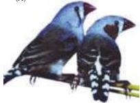
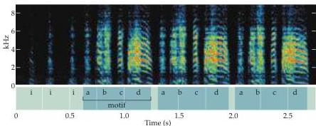
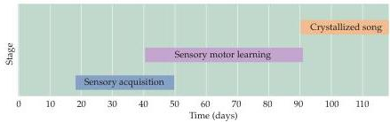

Modification of Brain Circuits as a Result of Experience 561

(A)
(A) A pair of zebra finches (the male is on the right), a species that has been the subject of many song acquisition studies.
(B) Spectrogram of the typical adult song.
The male's song comprises characteristic repeating elements including introductory notes (i), and single or multi-note syllables (a–d).
Syllables are grouped into motifs; both syllable structure and order are learned in this species.
(C) Chronology of song acquisition in the zebra finch.
(Courtesy of Rich Mooney.)

"naïve," but are innately biased to learn the songs of their own species over those of others.
In short, intrinsic factors make the nervous system of oscine birds especially sensitive to songs that are species-typical.
It is likely that similar biases influence human language learning.

(B)
(C)

# References

DOUPE, A.
AND P.
KUHL (1999) Birdsong and human speech: Common themes and mechanisms.
Annu.
Rev.
Neurosci.
22: 567–631.

ciably different speech elements (called phonemes) to produce spoken words (examples are the phonemes *ba* and *pa* in English; see Chapter 26).
Very young human infants can perceive and discriminate between differences in *all* human speech sounds, and are not innately biased towards phonemes characteristic of any particular language.
However, this universal perceptual capacity does not persist.
For example, adult Japanese speakers cannot reliably distinguish between the *r* and *l* sounds in English, presumably because this phonemic distinction is not made in Japanese and thus not reinforced by experience during the critical period.
Nonetheless, 4-month-old Japanese infants can make this discrimination as reliably as 4-month-olds raised in English-speaking households (as indicated by increased suckling frequency or head turning in the presence of a novel stimulus).
By 6 months of age, however, infants begin to show preferences for phonemes in their native language over those in foreign languages, and by the end of their first year no longer respond robustly to phonetic elements peculiar to non-native languages.
The ability to perceive these