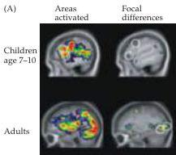
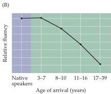

Chapter Twenty-Three

Figure 23.2 Learning language.
(A) Maps derived from fMRI in adults and children performing visual word processing tasks.
Images are sagittal sections with the front of the brain toward the left.
The top row shows the range of active areas (left) and foci of activity based on group averages (right) for children ages 7-10.
The bottom row shows analogous results for adults performing the same task.
(B) A critical period for learning language is shown by the decline in language ability (fluency) of non-native speakers of English as a function of their age upon arrival in the United States.
The ability to score well on tests of English grammar and vocabulary declines from approximately age 7 onward.
(A after Schlaggar et.
al., 2002; B after Johnson and Newport, 1989.)

phonemic contrasts, when attended to, evidently persists for several more years, as evidenced by the fact that children can learn to speak a second language without accent and with fluent grammar until about age 7 or 8.
After this age, however, performance gradually declines no matter what the extent of practice or exposure (Figure 23.2).

A number of changes in the developing brain could explain these observations.
One possibility is that experience acts selectively to preserve the circuits in the brain that perceive phonemes and phonetic distinctions.
The absence of exposure to non-native phonemes would then result in a gradual atrophy of the connections representing those sounds, accompanied by a declining ability to distinguish between them.
In this formulation, circuits that are used are retained, whereas those that are unused get weaker (and presumably disappear).
Alternatively, experience could promote the growth of rudimentary circuitry pertinent to the experienced sounds.
Recent comparisons of patterns of activity in children (age 7-10) and adults performing very specific word processing tasks suggest that different brain regions are activated for the same task in children and adults.
While the significance of such differences is not clear—they may reflect anatomical plasticity associated with critical periods, or distinct modes of performing language tasks in children versus adults—there is nevertheless an indication that brain circuits change to accommodate language function during early life.

# Critical Periods in Visual System Development

Although critical periods for language and other distinctively human behaviors are in some ways the most compelling examples of this phenomenon, it is difficult if not impossible to study the underlying changes in the human brain.
A much clearer understanding of how changes in connectivity might contribute to critical periods has come from studies of the developing visual system in experimental animals with highly developed visual abilities—particularly cats and monkeys.
In an extraordinarily influential series of experiments, David Hubel and Torsten Wiesel found that depriving animals of normal visual experience during a restricted period of early postnatal life irreversibly alters neuronal connections (and functions) in the visual cortex.
These observations provided the first evidence that the brain translates the effects of early experience (that is, patterns of neural activity) into more or less permanently altered wiring.

To understand these experiments and their implications, it is important to review the organization and development of the mammalian visual system.
Recall that information from the two eyes is first integrated in the primary visual (striate) cortex, where most afferents from the lateral geniculate nucleus of the thalamus terminate (see Chapter 11).
In some mammals—carnivores, anthropoid primates, and humans—the afferent terminals form an alternating series of eye-specific domains in cortical layer IV called ocular dominance columns (Figure 23.3).
As already described in Chapter 11, ocular dominance columns can be visualized by injecting tracers, such as radioactive proline, into one eye; the tracer is then transported along the visual pathway to specifically label the geniculocortical terminals (i.e., synaptic terminals in the visual cortex) corresponding to that eye (Figure 23.3, Box C).
In the adult macaque monkey, the domains representing the two eyes are stripes of about equal width  $(0.5\mathrm{mm})$  that occupy roughly equal areas of layer IV of the primary visual cortex.
Electrical recordings confirm that the cells within layer IV of macaques respond strongly or exclusively to stimulation of either the left or the right eye, while neurons in layers above