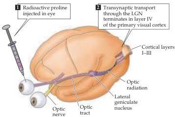
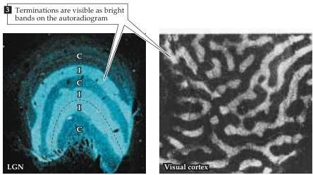

Modification of Brain Circuits as a Result of Experience

Figure 23.3 Ocular dominance columns (which in most anthropoid primates are really stripes or bands) in layer IV of the primary visual cortex of an adult macaque monkey.
Diagram indicates the labeling procedure (see also Box C); following transynaptic transport, the pattern of geniculocortical terminations related to that eye is visible as a series of bright stripes in this autoradiogram of a section through layer IV in the plane of the cortex (that is, as if looking down on the cortical surface).
The dark areas are the zones occupied by geniculocortical terminals related to the other eye.
The pattern of human ocular dominance columns is shown in Figure 12.10.
(From LeVay, Wiesel, and Hubel, 1980.)

and below layer IV integrate inputs from the left and right eyes and respond to visual stimuli presented to either eye.
Ocular dominance is thus apparent in two related phenomena: the degree to which individual cortical neurons are driven by stimulation of one eye or the other, and domains (stripes) in cortical layer IV in which the majority of neurons are driven exclusively by one eye or the other.
The clarity of these patterns of connectivity and the precision by which experience via the two eyes can be manipulated led to the series of experiments described in the following section that greatly clarified the neurobiological processes underlying critical periods.

# Effects of Visual Deprivation on Ocular Dominance

As described in Chapter 11, if an electrode is passed at a shallow angle through the cortex while the responses of individual neurons to stimulation of one or the other eye are being recorded, detailed assessment of ocular dominance can be made at the level of individual cells (see Figure 11.13).
In their original studies, Hubel and Wiesel assigned neurons to one of seven ocular dominance categories, and this classification scheme has become standard in the field.
Group 1 cells were defined as being driven only by stimulation of the contralateral eye; group 7 cells were driven entirely by the

sylvius