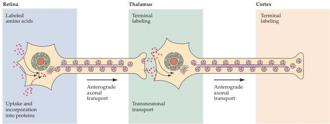

Chapter Twenty-Three

# Box C

## Transneuronal Labeling with Radioactive Amino Acids

Unlike many brain structures, ocular dominance columns are not easily visible by means of conventional histology.
Thus, the striking cortical patterns evident in cats and monkeys were not seen until the early 1970s, when the technique of anterograde tracing using radioactive amino acids was introduced.
In this approach, an amino acid commonly found in proteins (usually proline) is radioactively tagged and injected into the area of interest.
Neurons in the vicinity take up the label from the extracellular space and incorporate it into newly made proteins.
Some of these proteins are involved in the maintenance and function of the neuron's synaptic terminals; thus, they are shipped via anterograde transport from the cell body to nerve terminals, where they accumulate.
After a suitable interval, the tissue is fixed, and sections are made, placed on glass slides, and coated with a sensitive photographic emulsion.
The radioactive decay of the labeled amino acids in the proteins causes silver grains to form in the emulsion.
After several months of exposure, a heavy concentration of silver grains accumulates over the regions that contain synapses originating from the

injected site.
For example, injections into the eye will heavily label the terminal fields of retinal ganglion cells in the lateral geniculate nucleus.

Transneuronal transport takes this process a step further.
After tagged proteins reach the axon terminals, a fraction is actually released into the extracellular space, where the proteins are degraded into amino acids or small peptides that retain their radioactivity.
An even smaller fraction of this pool of labeled amino acids is taken up by the postsynaptic neurons, incorporated again into proteins, and transported to synaptic terminals of the second set of neurons.
Because the label passes from the presynaptic terminals of one set of cells to the postsynaptic target cells, the process is called transneuronal transport.
By such transneuronal labeling, the chain of connections originating from a particular structure can be visualized.
In the case of the visual system, proline injections into one eye label appropriate layers of the lateral geniculate nucleus (as well as

other retinal ganglion cell targets such as the superior colliculus), and subsequently the terminals in the visual cortex of the geniculate neurons receiving inputs from that eye.
Thus, when sections of the visual cortex are viewed with dark-field illumination to make the silver grains glow a brilliant white against the unlabeled background, ocular dominance columns in layer IV are easily seen (see Figure 23.3).

## References

COWAN, W.
M., D.
I.
GOTTLIEB, A.
HENDRICKSON, J.
L.
PRICE AND T.
A.
WOOLSEY (1972) The autoradiographic demonstration of axonal connections in the central nervous system.
Brain Res.
37: 21-51
GRAFSTEIN, B.
(1971) Transneuronal transfer of radioactivity in the central nervous system.
Science 172: 177-179.
GRAFSTEIN, B.
(1975) Principles of anterograde axonal transport in relation to studies of neuronal connectivity.
In The Use of Axonal Transport for Studies in Neuronal Connectivity, W.
M.
Cowan and M.
Cuénod (eds.).
Amsterdam: Elsevier, pp.
47-68.

Transneuronal transport.
A neuron in the retina is shown taking up a radioactive amino acid, incorporating it into proteins, and moving the proteins down the axons and across the extracellular space between neurons.
This process is repeated in the thalamus, and eventually label accumulates in the thalamocortical terminals in layer IV of the primary visual cortex.

