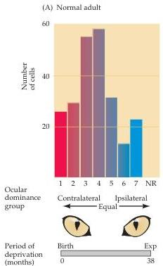
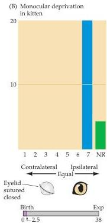
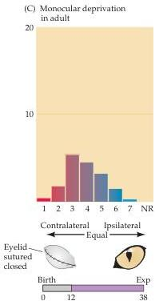

Modification of Brain Circuits as a Result of Experience

ipsilateral eye.
Neurons driven equally well by either eye were assigned to group 4.
Using this approach, they found that the ocular dominance distribution across the cortical layers in primary visual cortex is roughly Gaussian in a normal adult (cats were used in these experiments).
Most cells were activated to some degree by both eyes, and about a quarter were more activated by either the contralateral or ipsilateral eye (Figure 23.4A).

Hubel and Wiesel then asked whether this normal distribution of ocular dominance could be altered by visual experience.
When they simply closed one eye of a kitten early in life and let the animal mature to adulthood (which takes about 6 months), a remarkable change was observed.
Electrophysiological recordings now showed that very few cortical cells could be driven from the deprived eye; that is, the ocular dominance distribution had shifted such that nearly all cells were driven by the eye that had remained

Figure 23.4 Effect of early closure of one eye on the distribution of cortical neurons driven by stimulation of both eyes.
(A) Ocular dominance distribution of single unit recordings from a large number of neurons in the primary visual cortex of normal adult cats.
Cells in group 1 were activated exclusively by the contralateral eye, cells in group 7 by the ipsilateral eye.
Diagrams below these graphs indicate procedure, and bars indicate duration of deprivation (purple).
"Exp" = time at which experimental observations were made.
(B) Following closure of one eye from 1 week after birth until 2.5 months of age (indicated by the bar underneath the graph), no cells could be activated by the deprived (contralateral) eye.
Some cells could not be activated by either eye (NR).
Note that the closed eye is opened at the time of the experimental observations, and that the recordings are not restricted to any particular cortical layer.
(C) A much longer period of monocular deprivation in an adult cat has little effect on ocular dominance (although overall cortical activity is diminished).
In this case, the contralateral eye was closed from 12 to 38 months of age.
(A after Hubel and Wiesel, 1962; B after Wiesel and Hubel, 1963; C after Hubel and Wiesel, 1970.)

