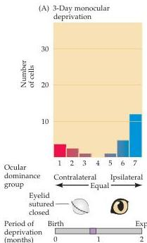
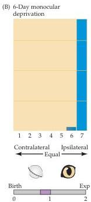

Chapter Twenty-Three

open (Figure 23.4B).
Recordings from the retina and lateral geniculate layers related to the deprived eye indicated that these more peripheral stations in the visual pathway worked quite normally.
Thus, the absence of cortical cells that responded to stimulation of the closed eye was not a result of retinal degeneration or a loss of retinal connections to the thalamus.
Rather, the deprived eye had been functionally disconnected from the visual cortex.
Consequently, such animals are behaviorally blind in the deprived eye.
This "cortical blindness," or amblyopia, is permanent (see next section).
Even if the formerly deprived eye is subsequently left open indefinitely, little or no recovery occurs.

Remarkably, the same manipulation—closing one eye—had no effect on the responses of cells in the visual cortex of an adult cat (Figure 23.4C).
If one eye of a mature cat was closed for a year or more, both the ocular dominance distribution measured across all cortical layers and the animal's visual behavior were indistinguishable from normal when tested through the reopened eye.
Thus, sometime between the time a kitten's eyes open (about a week after birth) and a year of age, visual experience determines how the visual cortex is wired with respect to eye dominance.
After this time, deprivation or manipulation has little or no permanent, detectable effect.
In fact, further experiments showed that eye closure is effective only if the deprivation occurs during the first 3 months of life.
In keeping with the ethological observations described earlier in the chapter, Hubel and Wiesel called this period of susceptibility to visual deprivation the critical period for the development of ocular dominance.
During the height of the critical period (about 4 weeks of age in the cat), as little as 3 to 4 days of eye closure profoundly alters the ocular dominance profile of the striate cortex (Figure 23.5).
Similar experiments in the monkey have shown that the same phenomenon occurs in primates, although the critical period is longer (up to about 6 months of age).

Figure 23.5 The consequences of a short period of monocular deprivation at the height of the critical period in the cat.
Just 3 days of deprivation in this example (A) produced a significant shift of cortical innervation in favor of the non-deprived eye; 6 days of deprivation (B) produced an almost a compete shift.
Bars below each histogram indicate the period of deprivation, as in Figure 23.4.
(After Hubel and Wiesel, 1970.)

