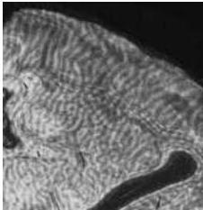
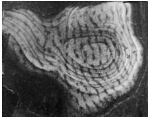

Modification of Brain Circuits as a Result of Experience 567

(A)

(B)
Figure 23.6 Effect of monocular deprivation on ocular dominance columns in the macaque monkey.
(A) In normal monkeys, ocular dominance columns seen as alternating stripes of roughly equal width are already present at birth.
(B) The picture is quite different after monocular deprivation.
This dark-field autoradiograph shows a reconstruction of several sections through layer IV of the primary visual cortex of a monkey whose right eye was sutured shut from 2 weeks of age to 18 months, when the animal was sacrificed.
Two weeks before death, the normal (left) eye was injected with radiolabeled amino acids (see Box C).
The columns related to the nondeprived eye (white stripes) are much wider than normal, whereas as those related to the deprived eye are shrunken.
(A from Horton and Hocking, 1999; B from Hubel et al., 1977.)

Thus the key advance arising from Hubel and Wiesel's early work was to show that visual deprivation causes changes in cortical connectivity that influence the functional response properties of individual neurons (Figure 23.6).
The implications of altered cortical circuitry as a result of experience was amply confirmed by subsequent anatomical studies.
In monkeys, the alternating stripelike patterns of geniculocortical axon terminals in layer IV representing the two eyes that define ocular dominance columns—is already present at birth (Figure 23.6A).
Thus, the visual cortex is clearly not a blank slate on which the effects of experience are later inscribed.
Nevertheless, animals deprived of vision in one eye from birth develop abnormal patterns of ocular dominance stripes in the visual cortex (Figure 23.6B).
The stripes related to the open eye are substantially wider than normal, whereas the stripes representing the deprived eye are correspondingly diminished.
The absence of cortical neurons that respond to the deprived eye in electrophysiological studies is not simply a result of the relatively inactive inputs withering away.
If this were the case, one would expect to see areas of layer IV devoid of any thalamic innervation.
Instead, inputs from the active (open) eye take over some of the territory that formerly belonged to the inactive (closed) eye.

Hubel and Wiesel interpreted these results as demonstrating a competitive interaction between the two eyes during the critical period (see Chapter 22).
In summary, the cortical representation of both eyes starts out equal, and in a normal animal, this balance is retained if both eyes experience roughly comparable levels of visual stimulation.
When, however, an imbalance in visual experience is induced by monocular deprivation, the active eye gains a competitive advantage and replaces many of the synaptic inputs from the closed eye, such that few if any neurons can be driven by the deprived eye (see Figure 22.4B).
These observations in experimental animals have important implications for children with birth defects or ocular injuries that cause an imbalance of inputs from the two eyes.
Unless the imbalance is corrected during the critical period, the child may ultimately have poor binocular fusion, diminished depth perception, and degraded acuity; in other words, the child's vision may be permanently impaired (see the next section).

The idea that a competitive imbalance underlies the altered distribution of inputs after deprivation has been confirmed by closing both eyes shortly after birth, thereby equally depriving all visual cortical neurons of normal experience during the critical period.
The arrangement of ocular dominance