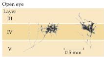
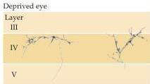
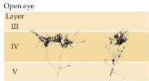
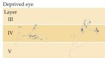

Chapter Twenty-Three

recorded some months later is, by either electrophysiological or anatomical criteria, much closer to normal than if just one eye is closed.
Although several peculiarities in the response properties of cortical cells are apparent, roughly normal proportions of neurons representing the two eyes are present.
Because there is no imbalance in the visual activity of the two eyes (both sets of related cortical inputs being deprived), both eyes retain their territory in the cortex.
If disuse atrophy of the closed-eye inputs were the main effect of deprivation, then binocular deprivation during the critical period would cause the visual cortex to be largely unresponsive.

Experiments using techniques that label individual axons from the lateral geniculate nucleus terminating in layer IV have shown in greater detail what happens to the arborizations of individual neurons after visual deprivation (Figure 23.7).
As noted, monocular deprivation causes a loss of cortical territory related to the deprived eye, with a concomitant expansion of the open eye's territory.
At the level of single axons, these changes are reflected in an increased extent and complexity of the arborizations related to the open eye, and a decrease in the size and complexity of the arborizations related to the deprived eye.
Individual neuronal arborizations can be substantially altered after as little as one week of deprivation, and perhaps even less.
This latter finding highlights the ability of developing thalamic and cortical neurons to rapidly remodel their connections—presumably making and breaking synapses—in response to environmental circumstances.

## Visual Deprivation and Amblyopia in Humans

These developmental phenomena in the visual system of experimental animals accord with clinical problems in children who have experienced similar deprivation.
The loss of acuity, diminished stereopsis, and problems with fusion that arise from early deficiencies of visual experience is called amblyopia (from the Greek meaning "dim sight").

In humans, amblyopia is most often the result of strabismus—a misalignment of the two eyes due to improper control of the direction of gaze by the eye muscles and referred to colloquially as "lazy eye." Depending on the muscles affected, the misalignment can produce convergent strabismus,

(A) Short-term monocular deprivation
Figure 23.7 Terminal arborizations of lateral geniculate nucleus axons in the visual cortex can change rapidly in response to monocular deprivation during the critical period.
(A) After only a week of monocular deprivation, axons from the deprived eye have greatly reduced numbers of branches compared with those from the open eye.
(B) Deprivation for longer periods does not result in appreciably larger changes.
Numbers on the left of each figure indicate cortical layers.
(After Antonini and Stryker, 1993.)

Deprived eye

(B) Long-term monocular deprivation

Deprived eye