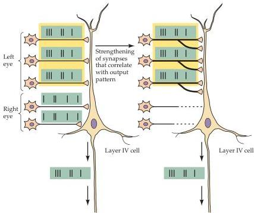

Chapter Twenty-Three

Figure 23.8 Representation of Hebb's postulate as it might operate during development of the visual system.
The cell represents a postsynaptic neuron in layer IV of the primary visual cortex.
Early in development, inputs from the two eyes converge on single postsynaptic cells.
The two sets of presynaptic inputs, however, have different patterns of electrical activity (represented by the short vertical bars).
In the example here, the three left eye inputs are better able to activate the postsynaptic cell; as a result, their activity is highly correlated with the postsynaptic cell's activity.
According to Hebb's postulate, these synapses are therefore strengthened.
The inputs from the right eye carry a different pattern of activity that is less well correlated with the majority of the activity elicited in the postsynaptic cell.
These synapses gradually weaken and are eventually eliminated (right-hand side of figure), while the correlated inputs form additional synapses.

whereas those that are persistently weakened by uncorrelated activity will eventually lose their hold on the postsynaptic cell (Figure 23.8; see also Chapter 22).
In the visual system, the action potentials of the thalamocortical inputs related to one eye are presumably better correlated with each other than with the activity related to the other eye—at least in layer IV.
If sets of correlated inputs tend to dominate the activity of groups of locally connected postsynaptic cells, this relationship would exclude uncorrelated inputs.
Thus, patches of cortex occupied exclusively by inputs representing one eye or the other could arise.
In this scenario, ocular dominance column rearrangements in layer IV are generated by cooperation between inputs carrying similar patterns of activity, and competition between inputs carrying dissimilar patterns.

Monocular deprivation, which dramatically changes ocular dominance columns, clearly alters both the levels and patterns of neural activity between the two eyes.
However, to specifically test the role of correlated activity in driving the competitive postnatal rearrangement of cortical connections, it is necessary to create a situation in which activity levels in each eye remain the same but the correlations between the two eyes are altered.
This circumstance can be created in experimental animals by cutting one of the extraocular muscles in one eye.
As already mentioned, this condition, in which the two eyes can no longer be aligned, is called strabismus.
The major consequence of strabismus is that corresponding points on the two retinas are no longer stimulated by objects in the same location in visual space at the same time.
As a result, differences in the visually evoked patterns of activity between the two eyes are far greater than normal.
Unlike monocular deprivation, however, the overall amount of activity in each eye remains roughly the same; only the correlation of activity arising from corresponding retinal points is changed.