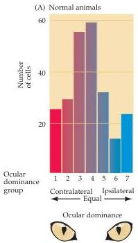
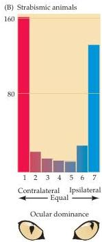

Modification of Brain Circuits as a Result of Experience

The effects of strabismus in experimental animals provide an illustration of the basic validity of Hebb's postulate.
Recall that misalignment of the two eyes can, depending on the details of the situation, lead to suppression of the input from one and eventual loss of the related cortical connections.
In other instances, however, input from the two eyes is retained.
The anatomical pattern of ocular dominance columns in layer IV of cats in which input from both eyes remains (but is asynchronous) is sharper than normal, implying that the uncoordinated patterns of activity have actually accentuated the normal separation of cortical inputs from the two eyes.
In addition, the ocular asynchrony prevents the binocular convergence that normally occurs in cells above and below layer IV: ocular dominance histograms from such animals show that most cells in all layers are driven exclusively by one eye or the other (Figure 23.9).
Evidently, strabismus not only accentuates the competition between the two sets of thalamic inputs in layer IV, but also prevents binocular interactions in the other layers, which are mediated by local connections originating from cells in layer IV.

Even before visual experience exerts these effects, innate mechanisms have ensured that the basic outlines of a functional system are present.
These intrinsic mechanisms establish the general circuitry required for vision, but allow modifications to accommodate the individual requirements that occur with changes in head size or eye alignment.
Normal visual experience evidently validates the initial wiring, preserving, augmenting, or adjusting the normal arrangement.
In the case of abnormal experience, such as monocular deprivation, the mechanisms that allow these adjustments result in more dramatic anatomical (and ultimately behavioral) changes, such as those that occur in amblyopia.
The eventual decline of this capacity to remodel cortical (and subcortical) connections is presumably the cellular basis of critical periods in a variety of neural systems, including the development of language and other higher brain functions.
By the same token, these differences in

Figure 23.9 Ocular dominance histograms obtained by electrophysiological recordings in normal adult cats (A) and adults cats in which strabismus was induced during the critical period (B).
The data in (A) is the same as that shown in Figure 23.3A.
The number of binocular cells is sharply decreased as a consequence of strabismus; most of the cells are driven exclusively by stimulation of one eye or the other.
This enhanced segregation of the inputs presumably results from the greater discrepancy in the patterns of activity between the two eyes as a result of surgically interfering with normal conjugate vision.
(After Hubel and Wiesel, 1965.)