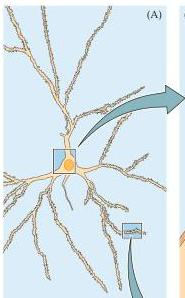
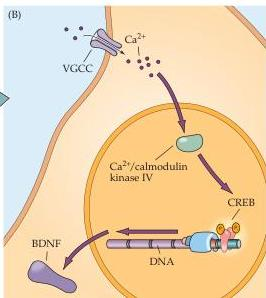
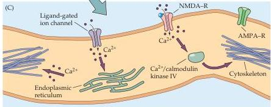

Modification of Brain Circuits as a Result of Experience

Figure 23.10 Transduction of electrical activity into cellular change via  $\mathrm{Ca^{2+}}$  signaling.
(A) A target neuron, showing two possible sites of action—the cell soma and the distal dendrites—for activity-dependent increases in  $\mathrm{Ca^{2+}}$  signaling.
(B) Correlated or sustained activity leads to increased  $\mathrm{Ca^{2+}}$  conductances and increased intracellular  $\mathrm{Ca^{2+}}$  concentration, which results in activation of  $\mathrm{Ca^{2+}}/$  calmodulin kinase IV (CaMKIV) in the nucleus.
CaMKIV then activates  $\mathrm{Ca^{2+}}$ -regulated transcription factors like CREB.
The target genes for activated CREB may include neurotrophic signals like BDNF, which when secreted by a cell may help stabilize or promote the growth of active synapses on that cell.
(C) Local increases in  $\mathrm{Ca^{2+}}$  signaling in distal dendrites due to correlated or sustained activity may lead to local increases in  $\mathrm{Ca^{2+}}$  concentration which, via kinases like CaMKIV, modify cytoskeletal elements (actin- or tubulin-based structures).
Changes in these elements lead to local changes in dendritic structure.
In addition, increased local  $\mathrm{Ca^{2+}}$  concentration may influence local translation of transcripts in the endoplasmic reticulum (ER), including transcripts for neurotransmitter receptors and other modulators of postsynaptic responses.
Increased  $\mathrm{Ca^{2+}}$  may also influence the trafficking of these proteins, their interaction with local scaffolds for cytoplasmic proteins, and their insertion into the postsynaptic membrane.
(After Wong and Ghosh, 2002.)

development.
In mice or rats, for instance, the anatomical patterns of "whisker barrels" in the somatic sensory cortex (see Chapter 8) can be altered by abnormal sensory experience during a narrow window in early postnatal life.
And, as outlined in Chapter 14, behavioral studies in the olfactory system indicate that exposure to maternal odors for a limited period can alter the ability to respond to such odorants, a change that can persist throughout life.
Clearly, the phenomenon of critical periods is general in development of sensory perceptual abilities and motor skills.

# Summary

An individual animal's history of interaction with the environment—its "experience"—helps to shape neural circuitry and thus determines subsequent behavior.
In some cases, experience functions primarily as a switch to activate innate behaviors.
More often, however, experience during a specific time in early life (referred to as a "critical period") helps shape the adult behavioral repertoire.
Critical periods influence behaviors as diverse as maternal bonding and the acquisition of language.
Although it is possible to define the behavioral consequences of critical periods for these complex