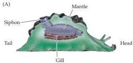
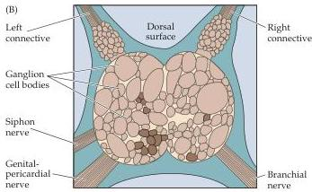
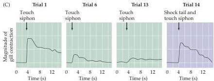
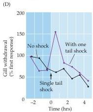
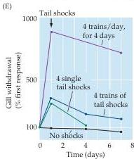

Chapter Twenty-Four

Figure 24.1 Short-term sensitization of the Aplysia gill withdrawal reflex.
(A) Diagram of the animal.
(B) The abdominal ganglion of Aplysia.
The cell bodies of many of the neurons involved in gill withdrawal can be recognized by their size, shape, and position within this ganglion.
(C) Changes in the gill withdrawal behavior due to habituation and sensitization.
The first time that the siphon is touched, the gill contracts vigorously.
Repeated touches elicit smaller gill contractions due to habituation.
Subsequently pairing a siphon touch with an electrical shock to the tail restores a large and rapid gill contraction, due to short-term sensitization.
(D) A short-term sensitization of the gill withdrawal response is observed following the pairing of a single tail shock with a siphon touch.
(E) Repeated applications of tail shocks causes prolonged sensitization of the gill withdrawal response.
(After Squire and Kandel, 1999.)

