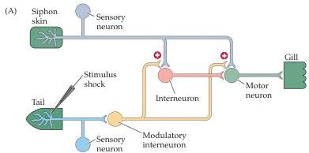
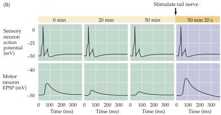
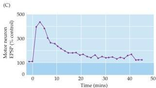

Chapter Twenty-Four

Figure 24.2 Synaptic mechanisms underlying short-term sensitization.
(A) Neural circuitry involved in sensitization.
Normally, touching the siphon skin activates sensory neurons that excite interneurons and gill motor neurons, yielding a contraction of the gill muscle.
A shock to the animal's tail stimulates modulatory interneurons that alter synaptic transmission between the siphon sensory neurons and gill motor neurons, resulting in sensitization.
(B) Changes in synaptic efficacy at the sensory-motor synapse during short-term sensitization.
Prior to sensitization, activating the siphon sensory neurons causes an EPSP to occur in the gill motor neurons.
Activation of the serotonergic modulatory interneurons enhances release of transmitter from the sensory neurons onto the motor neurons, increasing the EPSP in the motor neurons and causing the motor neurons to more strongly excite the gill muscle.
(C) Time course of the serotonin-induced facilitation of transmission at the sensory motor synapse.
(After Squire and Kandel, 1999.)

interneurons that release serotonin on to the presynaptic terminals of the sensory neurons of the siphon (see Figure 24.2A).
Serotonin enhances transmitter release from the siphon sensory neuron terminals, leading to increased synaptic excitation of the motor neurons (Figure 24.2B).
This modulation of the sensory neuron-motor neuron synapse lasts approximately an hour (Figure 24.2C), which is similar to the duration of the short-term sensitization of gill withdrawal produced by applying a single stimulus to the tail (Figure 24.1D).
Thus, the short-term sensitization apparently is due to recruitment of additional synaptic elements that modulate synaptic transmission in the gill withdrawal circuit.