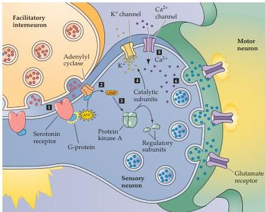
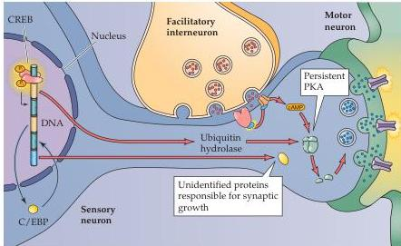

Chapter Twenty-Four

(A)

(B)
Figure 24.3 Mechanism of presynaptic enhancement underlying behavioral sensitization.
(A) Short-term sensitization is due to an acute, PKA-dependent enhancement of glutamate release from the presynaptic terminals of sensory neurons.
See text for explanation.
(B) Long-term sensitization is due to changes in gene expression, causing expression of proteins that change PKA activity and lead to changes in synapse growth.
(After Squire and Kandel, 1999.)