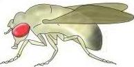
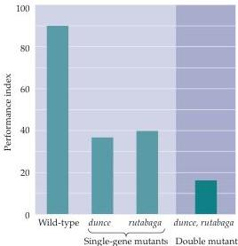

Plasticity of Mature Synapses and Circuits 581

# Box A

## Genetics of Learning and Memory in the Fruit Fly

As part of a renaissance in the genetic analysis of simple organisms in the mid-1970s, several investigators recognized that the genetic basis of learning and memory might be effectively studied in the fruit fly, *Drosophila melanogaster*.
In the intervening quarter-century, this approach has yielded some fundamental insights.
Although learning and memory has certainly been one of the more difficult problems tackled by *Drosophila* geneticists, their efforts have been surprisingly successful.
A number of genetic mutations have been discovered that to alter learning and memory, and the identification of these genes has provided a valuable framework for studying the cellular mechanisms of these processes.

The initial problem in this work was to develop behavioral tests that could identify abnormal learning and/or memory defects in large populations of flies.
This challenge was met by Seymour Benzer and his colleagues Chip Quinn and Bill Harris at the California Institute of Technology, who developed the olfactory and visual learning tests that have become the basis for most subsequent analyses of learning and memory in the fruit fly (see figure).
Behavioral paradigms pairing odors or light with an aversive stimulus allowed Benzer and his colleagues to assess associative learning in flies.
The design of an ingenious testing apparatus controlled for non-learning-related sensory cues that had previously complicated such behavioral testing.
Moreover, the apparatus allowed large numbers of flies to be screened relatively easily, expediting the analysis of mutagenized populations.

These studies led to the identification of an ever-increasing number of single gene mutations that disrupt learning and/or memory in flies.
The behavioral and molecular studies of the mutants (given whimsical but descriptive names like dunce, rutabaga, and amnesiac) suggested that a central pathway for learning and memory in the fly is signal transduction mediated by the cyclic nucleotide cAMP.
Thus, the gene products of the dunce, rutabaga, and amnesiac loci are, respectively, a phosphodiesterase (which degrades cAMP), an adenylyl cyclase (which converts ATP to cAMP), and a peptide transmitter that stimulates adenylyl cyclase.
This conclusion about the importance of cAMP has been confirmed by the finding that genetic manipulation of the CREB transcription factor also interferes with learning and memory in normal flies.

These observations in *Drosophila* accord with conclusions reached in studies of *Aplysia* and mammals (see text) and have emphasized the importance of cAMP-mediated learning and memory in a wide range of additional species.

## References

QUINN, W.
G., W.
A.
HARRIS AND S.
BENZER (1974) Conditioned behavior in *Drosophila melanogaster*.
Proc.
Natl.
Acad.
Sci.
USA 71: 708–712.

TULLY, T.
(1996) Discovery of genes involved with learning and memory: An experimental synthesis of Hirshian and Benzerian perspectives.
Proc.
Natl.
Acad.
Sci.
USA 93: 13460–13467.

WADDELL, S.
AND W.
G.
QUINN (2001) Flies, genes, and learning.
Annu.
Rev.
Neurosci.
24: 1283–1309.

WEINER, J.
(1999) *Time, Love, Memory: A Great Biologist and His Quest for the Origins of Behavior*.
New York: Knopf.

(A)

(B)

(A) The fruit fly, *Drosophila melanogaster*.
(B) Performance of normal and mutant flies on an olfactory learning task.
The performance of both dunce and rutabaga mutants on this task is diminished by at least 50%.
Flies that are mutant at both the dunce and rutabaga locus show a larger decrease in performance, suggesting that the two genes disrupt different but related aspects of learning.
(B after Tully, 1996.)