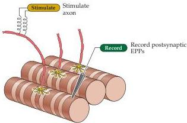
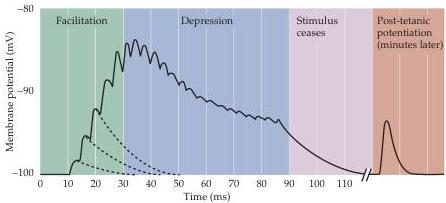

Plasticity of Mature Synapses and Circuits 583

Figure 24.4 Short-term plasticity at the neuromuscular synapse.
Electrical recording of EPPs elicited in a muscle fiber by a train of electrical stimuli applied to the presynaptic motor nerve.
Facilitation of the EPP occurs at the beginning of the stimulus train and is followed by depression of the EPP.
After the train of stimuli ends, EPPs are larger than before the train.
This phenomenon is called post-tetanic potentiation.
(After Katz, 1966.)

## Long-Term Synaptic Plasticity in the Mammalian Nervous System

Facilitation, depression, and post-tetanic potentiation can briefly modify synaptic transmission.
While these mechanisms are probably responsible for many short-lived changes in brain circuitry, they cannot provide the basis for memories or other manifestations of behavioral plasticity that persist for weeks, months, or years.
As might be expected, many synapses in the mammalian central nervous system exhibit long-lasting forms of synaptic plasticity that are plausible substrates for more permanent changes in behavior.
Because of their duration, these forms of synaptic plasticity are widely believed to be cellular correlates of learning and memory.
Thus, a great deal of effort has gone into understanding how they are generated.

Some patterns of synaptic activity in the CNS produce a long-lasting increase in synaptic strength known as long-term potentiation (LTP), whereas other patterns of activity produce a long-lasting decrease in synaptic strength, known as long-term depression (LTD).
LTP and LTD are broad terms that describe only the direction of change in synaptic efficacy; in fact, different cellular and molecular mechanisms can be involved in producing LTP or LTD at different synapses.
In general, these different forms of synaptic plasticity are produced by different histories of activity, and are mediated by different complements of intracellular signal transduction pathways in the nerve cells involved.