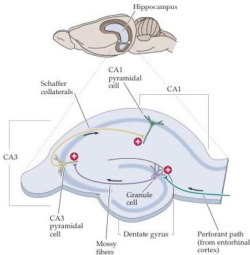

Chapter Twenty-Four

# Long-Term Potentiation of Hippocampal Synapses

LTP has been most thoroughly studied at excitatory synapses in the mammalian hippocampus, an area of the brain that is especially important in the formation and/or retrieval of some forms of memory (see Chapter 30).
In humans, functional imaging shows that the human hippocampus is activated during certain kinds of memory tasks, and that damage to the hippocampus results in an inability to form certain types of new memories.
In rodents, hippocampal neurons fire action potentials only when an animal is in certain locations.
Such "place cells" appear to encode spatial memories, an interpretation supported by the fact that hippocampal damage prevents rats from developing proficiency in spatial learning tasks (see Figure 30.7).
Although many other brain areas are involved in the complex process of memory formation, storage, and retrieval, these observations have led many investigators to study LTP of hippocampal synapses.

Work on LTP began in the late 1960s, when Terje Lomo and Timothy Bliss, working in the laboratory of Per Andersen in Oslo, Norway, discovered that a few seconds of high-frequency electrical stimulation can enhance synaptic transmission in the rabbit hippocampus for days or even weeks.
More recently, however, progress in understanding the mechanism of LTP has relied heavily on in vitro studies of slices of living hippocampus.
The arrangement of neurons allows the hippocampus to be sectioned such that most of the relevant circuitry is left intact.
In such preparations, the cell bodies of the pyramidal neurons lie in a single densely packed layer that is readily apparent (Figure 24.5).
This layer is divided into several distinct regions, the major ones being CA1 and CA3.
"CA" refers to cornu Ammon, the Latin for Ammon's horn—the ram's horn that resembles the shape of the hip

Figure 24.5 Diagram of a section through the rodent hippocampus showing the major regions, excitatory pathways, and synaptic connections.
Long-term potentiation has been observed at each of the three synaptic connections shown here.

