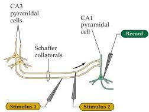
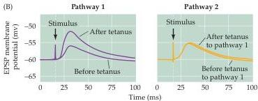
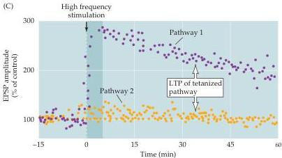

Plasticity of Mature Synapses and Circuits 585

pocampus.
The dendrites of pyramidal cells in the CA1 region form a thick band (the stratum radiatum), where they receive synapses from Schaffer collaterals, the axons of pyramidal cells in the CA3 region.
Much of the work on LTP has focused on the synaptic connections between the Schaffer collaterals and CA1 pyramidal cells.
Electrical stimulation of Schaffer collaterals generates excitatory postsynaptic potentials (EPSPs) in the postsynaptic CA1 cells (Figure 24.6A,B).
If the Schaffer collaterals are stimulated only two or three times per minute, the size of the evoked EPSP in the CA1 neurons remains constant.
However, a brief, high-frequency train of stimuli to the same axons causes LTP, which is evident as a long-lasting increase in EPSP amplitude (Figure 24.6C).
LTP occurs not only at the excitatory synapses of the hippocampus shown in Figure 24.5, but at many other synapses in a variety of brain regions, including the cortex, amygdala, and cerebellum.

(A)

(B)

(C)

Figure 24.6 Long-term potentiation of Schaffer collateral-CA1 synapses.
(A) Arrangement for recording synaptic transmission; two stimulating electrodes (1 and 2) each activate separate populations of Schaffer collaterals, thus providing test and control synaptic pathways.
(B) Left: Synaptic responses recorded in a CA1 neuron in response to single stimuli of synaptic pathway 1, minutes before and one hour after a high-frequency train of stimuli.
The high-frequency stimulus train increases the size of the EPSP evoked by a single stimulus.
Right: Responses produced by stimulating synaptic pathway 2, which did not receive high-frequency stimulation, is unchanged.
(C) The time course of changes in the amplitude of EPSPs evoked by stimulation of pathways 1 and 2.
High-frequency stimulation of pathway 1 causes a prolonged enhancement of the EPSPs in this pathway (purple).
This potentiation of synaptic transmission in pathway 1 persists for several hours, while the amplitude of EPSPs produced by pathway 2 (orange) remains constant.
(After Malinow et al., 1989.)