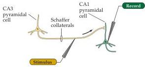
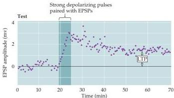

Chapter Twenty-Four

Figure 24.7 Pairing presynaptic and postsynaptic activity causes LTP.
Single stimuli applied to a Schaffer collateral synaptic input evokes EPSPs in the postsynaptic CA1 neuron.
These stimuli alone do not elicit any change in synaptic strength.
However, when the CA1 neuron's membrane potential is briefly depolarized (by applying current pulses through the recording electrode) in conjunction with the Schaffer collateral stimuli, there is a persistent increase in the EPSPs.
(After Gustafsson et al., 1987.)

LTP of the Schaffer collateral synapse exhibits several properties that make it an attractive neural mechanism for information storage.
First, LTP is state-dependent: The state of the membrane potential of the postsynaptic cell determines whether or not LTP occurs (Figure 24.7).
If a single stimulus to the Schaffer collaterals—which would not normally elicit LTP—is paired with strong depolarization of the postsynaptic CA1 cell, the activated Schaffer collateral synapses undergo LTP.
The increase occurs only if the paired activities of the presynaptic and postsynaptic cells are tightly linked in time, such that the strong postsynaptic depolarization occurs within about  $100\mathrm{ms}$  of presynaptic transmitter release.
Recall that a requirement for coincident activation of presynaptic and postsynaptic elements is the central postulate of Donald Hebb's early theories of the synaptic changes underlying the selective maintenance of neuronal connections (see Chapter 22).

LTP also exhibits the property of input specificity: When LTP is induced by the stimulation of one synapse, it does not occur in other, inactive synapses that contact the same neuron (see Figure 24.6).
Thus, LTP is restricted to activated synapses rather than to all of the synapses on a given cell (Figure 24.8A).
This feature of LTP is consistent with its involvement in memory formation (or at least the storage of specific information).
If activation of one set of synapses led to all other synapses—even inactive ones—being potentiated, it would be difficult to selectively enhance particular sets of inputs, as is presumably required to store specific information.

Another important property of LTP is associativity (Figure 24.8B).
As noted, weak stimulation of a pathway will not by itself trigger LTP.
However, if one pathway is weakly activated at the same time that a neighboring pathway onto the same cell is strongly activated, both synaptic pathways undergo LTP.
This selective enhancement of conjointly activated sets of synaptic inputs is often considered a cellular analog of associative or classical