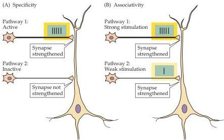

Plasticity of Mature Synapses and Circuits 587

Figure 24.8 Properties of LTP at a CA1 pyramidal neuron receiving synaptic inputs from two independent sets of Schaffer collateral axons.
(A) Strong activity initiates LTP at active synapses (pathway 1) without initiating LTP at nearby inactive synapses (pathway 2).
(B) Weak stimulation of pathway 2 alone does not trigger LTP.
However, when the same weak stimulus to pathway 2 is activated together with strong stimulation of pathway 1, both sets of synapses are strengthened.

conditioning.
More generally, associativity is expected in any network of neurons that links one set of information with another.

Although there is clearly a gap between understanding LTP of hippocampal synapses and understanding learning, memory, or other aspects of behavioral plasticity in mammals, this form of synaptic plasticity provides a plausible neural mechanism for long-lasting changes in a part of the brain that is known to be involved in the formation of certain kinds of memories.

## Molecular Mechanisms Underlying LTP

Despite the fact that LTP was discovered more than 30 years ago, its molecular underpinnings were not well understood until recently.
A key advance in this effort occurred in the mid-1980s, when it was discovered that antagonists of the NMDA type of glutamate receptor prevent LTP, but have no effect on the synaptic response evoked by low-frequency stimulation of the Schaffer collaterals.
At about the same time, the unique biophysical properties of the NMDA receptor were first appreciated.
As described in Chapter 6, the NMDA receptor channel is permeable to $\mathrm{Ca^{2+}}$, but is blocked by physiological concentrations of $\mathrm{Mg^{2+}}$.
This property provides a critical insight into how LTP is induced.
Thus, during low-frequency synaptic transmission, glutamate released by the Schaffer collaterals binds to both NMDA-type and AMPA/kainate-type glutamate receptors.
While both types of receptors bind glutamate, if the postsynaptic neuron is at its normal resting membrane potential, the NMDA channels will be blocked by $\mathrm{Mg^{2+}}$ ions and no current will flow (Figure 24.9, left).
Because blockade of the NMDA channel by $\mathrm{Mg^{2+}}$ is voltage-dependent, the function of the synapse changes markedly when the postsynaptic cell is depolarized.
Thus, conditions that induce LTP, such as high-frequency stimulation (as in Figure 24.6), will cause a prolonged depolarization that results in $\mathrm{Mg^{2+}}$ being expelled from the NMDA channel (Figure 24.9, right).
Removal of $\mathrm{Mg^{2+}}$ allows $\mathrm{Ca^{2+}}$ to enter the postsynaptic neuron and the resulting increase in $\mathrm{Ca^{2+}}$ concentration within the dendritic spines of the postsynaptic cell turns out to be the trigger for LTP (Box B).
The