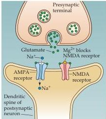
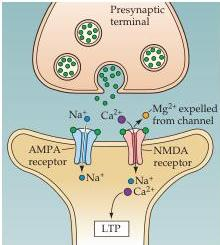

Chapter Twenty-Four

At resting potential

During postsynaptic depolarization
Figure 24.9 The NMDA receptor channel can open only during depolarization of the postsynaptic neuron from its normal resting level.
Depolarization expels  $\mathrm{Mg}^{2+}$  from the NMDA channel, allowing current to flow into the postsynaptic cell.
This leads to  $\mathrm{Ca}^{2+}$  entry, which in turn triggers LTP.
(After Nicoll et al., 1988.)

NMDA receptor thus behaves like a molecular "and" gate: The channel opens (to induce LTP) only when glutamate is bound to NMDA receptors and the postsynaptic cell is depolarized to relieve the  $\mathrm{Mg}^{2+}$  block of the NMDA channel.
Thus, the NMDA receptor can detect the coincidence of two events.

These properties of the NMDA receptor can account for many of the characteristics of LTP.
The specificity of LTP (see Figure 24.8A) can be explained by the fact that NMDA channels will be opened only at synaptic inputs that are active and releasing glutamate, thereby confining LTP to these sites.
With respect to associativity (see Figure 24.8B), a weakly stimulated input releases glutamate, but cannot sufficiently depolarize the postsynaptic cell to relieve the  $\mathrm{Mg}^{2+}$  block.
If neighboring inputs are strongly stimulated, however, they provide the "associative" depolarization necessary to relieve the block.
The state dependence of LTP, evident as the induction of LTP by the pairing of weak synaptic input with depolarization (see Figure 24.7), should work similarly: The synaptic input releases glutamate, while the coincident depolarization relieves the  $\mathrm{Mg}^{2+}$  block of the NMDA receptor.

Several sorts of observations have confirmed that a rise in the concentration of  $\mathrm{Ca^{2+}}$  in the postsynaptic CA1 neuron, due to  $\mathrm{Ca^{2+}}$  ions entering through NMDA receptors, serves as a second messenger signal that induces LTP.
Imaging studies, for instance, have shown that activation of NMDA receptors causes increases in postsynaptic  $\mathrm{Ca^{2+}}$  levels.
Furthermore, injection of  $\mathrm{Ca^{2+}}$  chelators blocks LTP induction, whereas elevation of  $\mathrm{Ca^{2+}}$  levels in postsynaptic neurons potentiates synaptic transmission.
 $\mathrm{Ca^{2+}}$  induces LTP by activating complicated signal transduction cascades that include protein kinases in the postsynaptic neuron.
At least two  $\mathrm{Ca^{2+}}$ -activated protein kinases have been implicated in LTP induction (Figure 24.10):  $\mathrm{Ca^{2+}}$ /calmodulin-dependent protein kinase (CaMKII) and protein kinase C (PKC; see