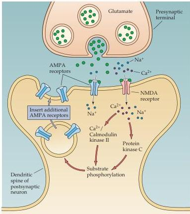

Plasticity of Mature Synapses and Circuits 589

Figure 24.10 Mechanisms underlying LTP.
During glutamate release, the NMDA channel opens only if the postsynaptic cell is sufficiently depolarized.
The $\mathrm{Ca^{2+}}$ ions that enter the cell through the channel activate postsynaptic protein kinases.
These kinases may act postsynaptically to insert new AMPA receptors into the postsynaptic spine, thereby increasing the sensitivity to glutamate.

Chapter 7).
CaMKII seems to play an especially important role: This enzyme is the most abundant postsynaptic protein at Schaffer collateral synapses, and pharmacological inhibition or genetic deletion of CaMKII prevents LTP.
The downstream targets of these kinases are not yet fully known, but apparently include the AMPA class of glutamate receptors.

Recent efforts have clarified the mechanism(s) responsible for the expression of LTP, namely how LTP causes synapses to be strengthened for prolonged periods.
The most likely explanation is that LTP arises from changes in the sensitivity of the postsynaptic cell to glutamate.
Several recent observations indicate that excitatory synapses can dynamically regulate their postsynaptic glutamate receptors and can even add new AMPA receptors to "silent" synapses that did not previously have postsynaptic AMPA receptors (Box C).
The "expression" or maintenance of LTP apparently is due to such insertion of AMPA receptors into the postsynaptic membrane (as opposed to its "induction," which relies on the activity of the NMDA receptors).
For example, synaptic activity that induces LTP can elicit postsynaptic responses