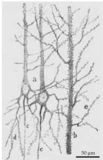
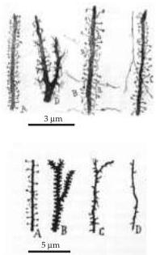
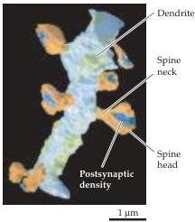
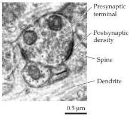

Chapter Twenty-Four

# Box B

## Dendritic Spines

Many synapses in the brain involve small protrusions from dendritic branches known as spines (Figure A).
Spines are distinguished by the presence of globular tips called spine heads; when spines are present, the synapses innervating dendrites are made from these heads.
Spine heads are connected to the main shafts of dendrites by narrow links called spine necks (Figure B).
Just beneath the site of contact between the terminals and the spine heads are intracellular structures called postsynaptic densities (Figure C).
The number, size, and shape of dendritic spines are quite variable and can, at least in some cases, change dynamically over time (see Figure 24.14B).

Since the earliest description of these structures by Santiago Ramón y Cajal in the late 1800s, dendritic spines have fascinated generations of neuroscientists, inspiring many speculations about their function.
One of the earliest conjectures was that the narrow spine neck electrically isolates synapses from the rest of the neuron.
Given that the size of spine necks can change, such a mechanism could cause the physiological effect of individual synapses to vary over time, thereby providing a cellular mechanism for forms of synaptic plasticity such as LTP and LTD.
However, subsequent measurements of the properties of spine necks indicate that these structures would be relatively ineffective in attenuating the flow of electrical current between spine heads and dendrites.

Another theory—currently the most popular functional concept—postulates that spines create biochemical compartments.
This idea is based on the supposition that the spine neck could prevent diffusion of biochemical signals from the spine head to the rest of the dendrite.
Several observations are consistent with this notion.
First, measurements show that the spine neck does indeed serve as a barrier to diffusion, slowing the rate of molecular movement by a factor of 100 or more.
Second, spines are found only at excitatory synapses, where it is known that synaptic transmission generates

(A) Cajal's classic drawings of dendritic spines.
Left, Dendrites of cortical pyramidal neurons.
Right, higher-magnification images of several different types of dendritic spines.
(B) High-resolution electron microscopic reconstruction of a small region of the dendrite of a hippocampal pyramidal neuron.
(C) Electron micrograph of a cross section through an excitatory synapse.
(A from DeFelipe and Jones, 1988; B from Harris, 1994; C from Kennedy, 2000.)

(B)

(C)