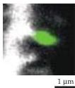
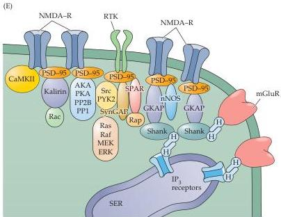

Plasticity of Mature Synapses and Circuits 591

many diffusible signals, most notably the second messenger $\mathrm{Ca^{2+}}$.
Finally, fluorescence imaging shows that synaptic $\mathrm{Ca^{2+}}$ signals can indeed be restricted to dendritic spines (Figure D).

Nevertheless, there are counterarguments to the hypothesis that spines provide relatively isolated biochemical compartments.
For example, it is known that other second messengers, such as $\mathrm{IP}_{3}$, can diffuse out of the spine head and into the dendritic shaft.
Presumably this difference in diffusion is due to the fact that $\mathrm{IP}_{3}$ signals last longer than $\mathrm{Ca^{2+}}$ signals, allowing $\mathrm{IP}_{3}$ sufficient time to overcome the diffusion barrier of the spine neck.
Another relevant point is that postsynaptic $\mathrm{Ca^{2+}}$ signals are highly localized, even at excitatory synapses that do not have spines.
Thus, in at least some instances, spines are neither necessary nor sufficient for localization of synaptic second messenger signaling.

A final and less controversial idea is that the purpose of spines is to serve as reservoirs where signaling proteins, such as the downstream molecular targets of $\mathrm{Ca^{2+}}$ and $\mathrm{IP}_{3}$, can be concentrated.
Consistent with this possibility, glutamate receptors are highly concentrated on spine heads, and the postsynaptic density comprises dozens of proteins involved in intracellular signal transduction (Figure E).
According to this view, the spine head is the destination for these signaling molecules during the assembly of synapses, as well as the target of the second messengers that are produced by the local activation of glutamate receptors.
Although the function of dendritic spines remains enigmatic, Cajal undoubtedly would be pleased at the enormous amount of attention that these tiny synaptic structures continue to command, and the real progress that has been made in understanding the variety of things they are capable of doing.

(D)

(D) Localized $\mathrm{Ca^{2+}}$ signal (green) produced in the spine of a hippocampal pyramidal neuron following activation of a glutamatergic synapse.
(E) Postsynaptic densities include dozens of signal transduction molecules, including glutamate receptors (NMDA-R; mGluR), tyrosine kinase receptors (RTK), and many intracellular signal transduction molecules, most notably the protein kinase CaMKII.
(D from Sabatini et al., 2002; E after Sheng and Kim, 2002.)

# References

GOLDBERG, J.
H., G.
TAMAS, D.
ARONOV AND R.
YUSTE (2003) Calcium microdomains in aspiny dendrites.
Neuron 40: 807-821.
HARRIS, K.
M.
(1994) Serial electron microscopy as an alternative or complement to confocal microscopy for the study of synapses and dendritic spines in the central nervous system.
In Three-Dimensional Confocal Microscopy: Volume Investigation of Biological Specimens.
New York: Academic Press.
HARRIS, K.
M.
AND J.
K.
STEVENS (1988) Dendritic spines of rat cerebellar Purkinje cells: serial electron microscopy with reference to their biophysical characteristics.
J.
Neurosci.
8:4455-4469.
KENNEDY, M.
B.
(2000) Signal-processing machines at the postsynaptic density.
Science 290: 750-754.

MIYATA, M.
AND 9 OTHERS (2000) Local calcium release in dendritic spines required for long-term synaptic depression.
Neuron 28: 233-244.
NIMCHINSKY, E.
A., B.
L.
SABATINI AND K.
SVOBODA (2002) Structure and function of dendritic spines.
Annu.
Rev.
Physiol.
64: 313-353.
SABATINI, B.
L., T.
G.
OERTNER AND K.
SVOBODA (2002) The life cycle of $\mathrm{Ca^{2+}}$ ions in dendritic spines.
Neuron 33: 439-452.
SHENG, M.
AND M.
J.
KIM (2002) Postsynaptic signaling and plasticity mechanisms.
Science 298: 776-780.
YUSTE, R.
AND D.
W.
TANK (1996) Dendritic integration in mammalian neurons, a century after Cajal.
Neuron 16: 701-716.