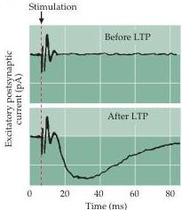
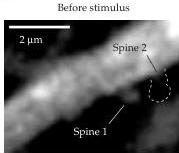
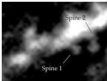

Chapter Twenty-Four

(A)

(B)

After stimulus
Figure 24.11 Insertion of postsynaptic AMPA receptors during LTP.
(A) LTP induces AMPA receptor responses at silent synapses in the hippocampus.
Prior to inducing LTP, no EPSCs are elicited at  $-65\mathrm{mV}$  at this silent synapse (upper trace).
After LTP induction, the same stimulus produces EPSCs that are mediated by AMPA receptors (lower trace).
(B) Distribution of fluorescently labeled AMPA receptor subunits (GluR1) before and 30 minutes after a high-frequency stimulus that can induce LTP.
While the AMPA receptors of spine 1 did not change, there was a rapid delivery of AMPA receptors into spine 2 following the stimulus.
(A after Liao et al., 1995; B from Shi et al., 1999.)

mediated by AMPA receptors at silent synapses (Figure 24.11A).
Such rapid insertion of new AMPA receptors also can occur at "non-silent" excitatory synapses.
Further, fluorescently tagged AMPA receptors can be seen to move into synapses under conditions that induce LTP (Figure 24.11B).
Addition of these new AMPA receptors would be expected to increase the response of the postsynaptic cell to released glutamate, strengthening synaptic transmission as long as LTP is maintained.
Under some circumstances, LTP also can cause a sustained increase in the ability of presynaptic terminals to release glutamate.
Because LTP clearly is triggered by the actions of  $\mathrm{Ca^{2+}}$  within the postsynaptic neuron (see Figure 24.10), this presynaptic potentiation requires that a retrograde signal (perhaps NO) spread from the postsynaptic region to the presynaptic terminals.

# Long-Term Synaptic Depression

If synapses simply continued to increase in strength as a result of LTP, eventually they would reach some level of maximum efficacy, making it difficult to encode new information.
Thus, to make synaptic strengthening useful, other processes must selectively weaken specific sets of synapses.
Long-term depression (LTD) is such a process.
In the late 1970s, LTD was found to occur at the synapses between the Schaffer collaterals and the CA1 pyramidal cells in the hippocampus.
Whereas LTP at these synapses requires brief, high-frequency stimulation, LTD occurs when the Schaffer collaterals are stimulated at a low rate—about  $1\mathrm{Hz}$ —for long periods (10–15 minutes).
This pattern of