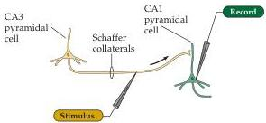
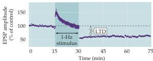
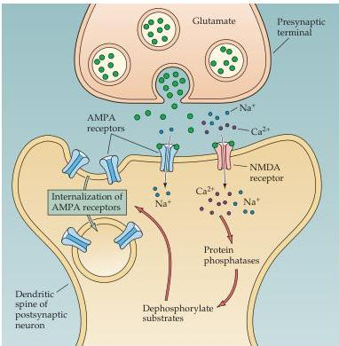

Plasticity of Mature Synapses and Circuits 593

activity depresses the EPSP for several hours and, like LTP, is specific to the activated synapses (Figure 24.12A,B).
Moreover, LTD can erase the increase in EPSP size due to LTP, and, conversely, LTP can erase the decrease in EPSP size due to LTD.
This complementarity suggests that LTD and LTP reversibly affect synaptic efficiency by acting at a common site.

(A)

(B)

(C)
Figure 24.12 Long-term synaptic depression in the hippocampus.
(A) Electrophysiological procedures used to monitor transmission at the Schaffer collateral synapses on to CA1 pyramidal neurons.
(B) Low-frequency stimulation (1 per second) of the Schaffer collateral axons causes a long-lasting depression of synaptic transmission.
(C) Mechanisms underlying LTD.
A low-amplitude rise in $\mathrm{Ca^{2+}}$ concencentration in the postsynaptic CA1 neuron activate postsynaptic protein phosphatases, which cause internalization of postsynaptic AMPA receptors, thereby decreasing the sensitivity to glutamate released from the Schaffer collateral terminals.
(B after Mulkey et al., 1993.)