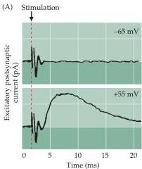
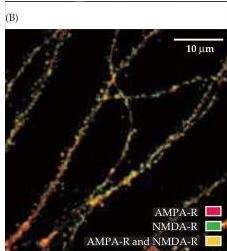

Chapter Twenty-Four

# Box C

## Silent Synapses

Several recent observations indicate that postsynaptic glutamate receptors are dynamically regulated at excitatory synapses.
Early insight into this process came from the finding that stimulation of some glutamatergic synapses generates no postsynaptic electrical signal when the postsynaptic cell is at its normal resting membrane potential (Figure A).
However, once the postsynaptic cell is depolarized, these "silent synapses" can transmit robust postsynaptic electrical responses.
The fact that transmission at such synapses can be turned on or off in response to postsynaptic activity suggests an interesting and simple means of modifying neural circuitry.

Silent synapses are especially prevalent in development and have been found in many brain regions, including the hippocampus, cerebral cortex, and spinal cord.
The silence of these synapses is evidently due to the voltage-dependent blockade of NMDA receptors by $\mathrm{Mg^{2+}}$ (see text and Chapter 6).
At the normal resting membrane potential, presynaptic release of glutamate evokes no postsynaptic response at such synapses because their NMDA receptors are blocked by $\mathrm{Mg^{2+}}$.
However, depolarization of the postsynaptic neuron displaces

(A) Electrophysiological evidence for silent synapses.
Stimulation of some axons fails to activate synapses when the postsynaptic cell is held at a negative potential ($-65\mathrm{mV}$, upper trace).
However, when the postsynaptic cells is depolarized ($+55\mathrm{mV}$), stimulation produces a robust response (lower trace).
(B) Immunofluorescent localization of NMDA receptors (green) and AMPA receptors (red) in a cultured hippocampal neuron.
Many dendritic spines are positive for NMDA receptors but not AMPA receptors, indicating NMDA receptor-only synapses.
(A after Liao et al., 1999; B courtesy of M.
Ehlers.)

the $\mathrm{Mg^{2+}}$, allowing glutamate release to induce postsynaptic responses mediated by NMDA receptors.

Glutamate released at silent synapses evidently binds only to NMDA receptors.
How, then, does glutamate release avoid activating AMPA receptors? One possibility is that glutamate released onto neighboring neurons diffuses to synapses on the neuron from which the

electrical recording is being made.
In this case, the diffusing glutamate may be present at concentrations sufficient to activate the high-affinity NMDA receptors, but not the low-affinity AMPA receptors.
A second possibility is that a silent synapse has both AMPA and NMDA receptors, but its AMPA receptors are somehow not functional.
Finally, some excitatory synapses may have only

LTP and LTD at the Schaffer collateral-CA1 synapses actually share several key elements.
Both require activation of NMDA-type glutamate receptors and the resulting entry of $\mathrm{Ca^{2+}}$ into the postsynaptic cell.
The major determinant of whether LTP or LTD arises appears to be the amount of $\mathrm{Ca^{2+}}$ in the postsynaptic cell: Small rises in $\mathrm{Ca^{2+}}$ lead to depression, whereas large increases trigger potentiation.
As noted above, LTP is at least partially due to activation of CaMKII, which phosphorylates target proteins.
LTD, on the other hand, appears to result from activation of $\mathrm{Ca^{2+}}$-dependent phosphatases that cleave phosphate groups from these target molecules (see Chapter 7).
Evidence in support of this idea is that phosphatase inhibitors prevent LTD, but have no effect on LTP.
The different effects of $\mathrm{Ca^{2+}}$ during LTD and LTP may arise from the selective activation of protein phosphatases and kinases by low and high levels of $\mathrm{Ca^{2+}}$.
While the phosphatase substrates important for LTD have not yet been identified, it is possible that LTP