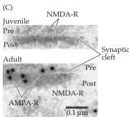
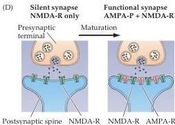

Plasticity of Mature Synapses and Circuits 595

(C) Electron microscopy of excitatory synapses in CA1 stratum radiatum of the hippocampus from 10-day-old or 5-week-old (adult) rats double-labeled for AMPA receptors and NMDA receptors.
The presynaptic terminal (pre), synaptic cleft, and postsynaptic spine (post) are indicated.
AMPA receptors are abundant at the adult synapse, but absent from the younger synapse.
(D) Diagram of glutamatergic synapse maturation.
Early in postnatal development, many excitatory synapses contain only NMDA receptors.
As synapses mature, AMPA receptors are recruited.
(C from Petralia et al., 1999.)

NMDA receptors.
Accumulating evidence supports the latter explanation.
Most compelling are immunocytochemical experiments demonstrating the presence of excitatory synapses that have only NMDA receptors (green spots in Figure B).
Such NMDA receptor-only synapses are particularly abundant early in postnatal development and decrease in adults (Figure C).
Thus, at least some silent synapses are not a separate class of excitatory synapses that lack AMPA receptors, but rather an early stage in the ongoing maturation of the glutamatergic

synapse (Figure D).
Evidently, AMPA and NMDA receptors are not inextricably linked at excitatory synapses, but are targeted via independent cellular mechanisms.
Such synapse-specific glutamate receptor composition implies sophisticated mechanisms for regulating the localization of each type of receptor.
Dynamic changes in the trafficking of AMPA and NMDA receptors can strengthen or weaken synaptic transmission and are important in LTP and LTD, as well as in the maturation of glutamatergic synapses.

Although silent synapses have begun to whisper their secrets, much remains to be learned about their physiological importance and the molecular mechanisms that mediate rapid recruitment or removal of synaptic AMPA receptors.

# References

GOMPERTS, S.
N., A.
RAO, A.
M.
CRAIG, R.
C.
MALENKA AND R.
A.
NICOLL (1998) Postsynaptically silent synapses in single neuron cultures.
Neuron 21: 1443-1451.
LIAO, D., N.
A.
HESSLER AND R.
MALINOW (1995) Activation of postsynaptically silent synapses during pairing-induced LTP in CA1 region of hippocampal slice.
Nature 375: 400-404.
LUSCHER, C., R.
A.
NICOLL, R.
C.
MALENKA AND D.
MULLER (2000) Synaptic plasticity and dynamic modulation of the postsynaptic membrane.
Nature Neurosci.
3: 545-550.
PETRALIA, R.
S.
AND 6 OTHERS (1999) Selective acquisition of AMPA receptors over postnatal development suggests a molecular basis for silent synapses.
Nature Neurosci.
2: 31-36.

and LTD phosphorylate and dephosphorylate the same set of regulatory proteins to control the efficacy of transmission at the Schaeffer collateral-CA1 synapse.
Just as LTP at this synapse is associated with insertion of AMPA receptors, LTD is often associated with a loss of synaptic AMPA receptors.
This loss probably arises from internalization of AMPA receptors into the postsynaptic cell (Figure 24.12C), due to the same sort of clathrin-dependent endocytosis mechanisms important for synaptic vesicle recycling in the presynaptic terminal (see Chapter 5).

A somewhat different form of LTD is observed in the cerebellum (see Chapter 18).
LTD of synaptic inputs onto cerebellar Purkinje cells was first described by Masao Ito and colleagues in Japan in the early 1980s.
Purkinje neurons in the cerebellum receive two distinct types of excitatory input: climbing fibers and parallel fibers (Figure 24.13A; see Chapter 18).
LTD reduces the strength of transmission at the parallel fiber synapse (Figure 24.13B) and has