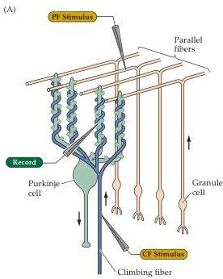
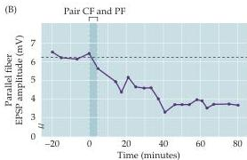
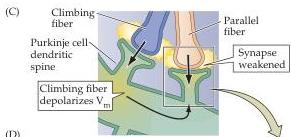
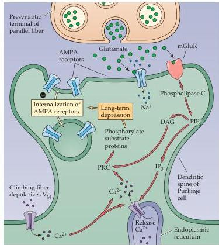

Chapter Twenty-Four

Figure 24.13 Long-term synaptic depression in the cerebellum.
(A) Experimental arrangement.
Synaptic responses were recorded from Purkinje cells following stimulation of parallel fibers and climbing fibers.
(B) Pairing stimulation of climbing fibers (CF) and parallel fibers (PF) causes LTD that reduces the parallel fiber EPSP.
(C) LTD requires depolarization of the Purkinje cell, produced by climbing fiber activation, as well as signals generated by active parallel fiber synapses.
(D) Mechanism underlying cerebellar LTD.
Glutamate released by parallel fibers activates both AMPA receptors and metabotropic glutamate receptors.
The latter produces two second messengers, DAG and  $\mathrm{IP}_3$ , which interact with  $\mathrm{Ca}^{2+}$  that enters when climbing fiber activity opens voltage-gated  $\mathrm{Ca}^{2+}$  channels.
This leads to activation of PKC, which triggers clathrin-dependent internalization of postsynaptic AMPA receptors to weaken the parallel fiber synapse.
(B after Sakurai, 1987.)