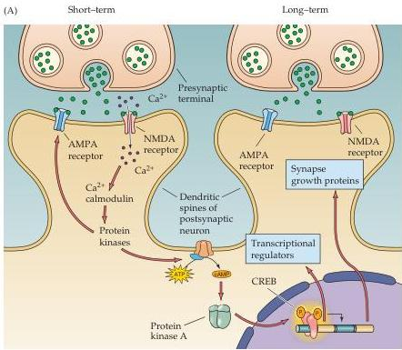
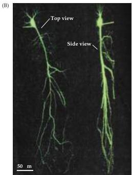
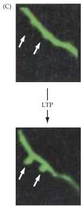

Chapter Twenty-Four

Figure 24.14 Mechanisms responsible for long-lasting changes in synaptic transmission during LTP.
(A) The late component of LTP is due to PKA activating the transcriptional regulator CREB, which turns on expression of a number of genes that produce long-lasting changes in PKA activity and synapse structure.
(B,C) Structural changes associated with LTP in the hippocampus.
(B) The dendrites of a CA1 pyramidal neuron were visualized by filling the cell with a fluorescent dye.
(C) New dendritic spines (white arrows) can be observed to appear approximately 1 hour after a stimulus that induces LTP.
The presence of novel spines raises the possibility that LTP may arise, in part, from formation of new synapses.
(A after Squire and Kandel, 1999; B and C after Engert and Bonhoeffer, 1999.)

