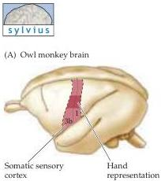
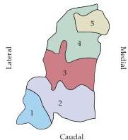
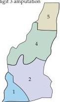

Plasticity of Mature Synapses and Circuits 599

tacts increases during LTP (Figure 24.14B,C).
Thus, it is likely that some of the proteins newly synthesized during LTP are involved in construction of new synaptic contacts.
While evidence for late components of hippocampal LTD is unclear, CREB may also be required for a late phase of LTD in the cerebellum.

In summary, behavioral plasticity requires activity-dependent synaptic changes that lead to changes in the functional connections within and among neural circuits.
These changes in the efficacy and local geometry of connectivity provide a basis not only for learning, memory, and other forms of plasticity, but also some pathologies.
Thus, abnormal patterns of neuronal activity, such as those that occur in epilepsy, can stimulate abnormal changes in synaptic connections that may further increase the frequency and severity of seizures (Box D).
Despite the substantial advances in understanding the cellular and molecular bases of some forms of plasticity, how selective changes of synaptic strength encode memories or other complex behavioral modifications in the mammalian brain is simply not known.

## Plasticity in the Adult Cerebral Cortex

In addition to these cellular and molecular studies of synaptic plasticity, a good deal is now known about plasticity of adult cortical maps and of the receptive field properties of mature cortical neurons.
Until the late 1970s, it was assumed that significant reorganization of cortical circuitry happened primarily during early postnatal development.
This conclusion was based on the evidence for critical periods described in the preceding chapter, and on the relative permanence of neural deficits after CNS trauma in adults.

This view has to some extent been modified by evidence that topographic maps in the somatic sensory cortex of adult monkeys are actually capable of appreciable reorganization.
As described in Chapter 8, the four cortical areas that define the primate somatic sensory cortex (Brodmann's areas 3a, 3b, 1, and 2) each contain a complete topographic representation of the body surface.
Jon Kaas and Michael Merzenich took advantage of this arrangement by carefully defining the normal spatial organization of topographic maps in these regions.
They then amputated a digit (or cut one of the nerves that innervate the hand) and reexamined topographical maps in the same animals several weeks later.
Surprisingly, the somatic sensory cortex had changed: The cortical neurons that had been deprived of their normal peripheral input now responded to stimulation of other parts of the animal's hand (Figure 24.15).
For example, if the third digit was amputated, cortical neurons that formerly responded to stimulation of digit 3 responded to stimulation of digits 2 or 4.
Thus, the central representation of the remaining digits had expanded to take over the cortical territory that had lost its main input.
Such "functional re-mapping" also occurs in the somatic sensory nuclei in the thalamus and brainstem; indeed, some of the reorganization of cortical circuits

(B) Normal hand representation

Figure 24.15 Functional changes in the somatic sensory cortex of an owl monkey following amputation of a digit.
(A) Diagram of the somatic sensory cortex in the owl monkey, showing the approximate location of the hand representation.
(B) The hand representation in the animal before amputation; the numbers correspond to different digits.
(C) The cortical map determined in the same animal two months after amputation of digit 3.
The map has changed substantially; neurons in the area formerly responding to stimulation of digit 3 now respond to stimulation of digits 2 and 4.
(After Merzenich et al., 1984.)

(C) Hand representation two months after digit 3 amputation