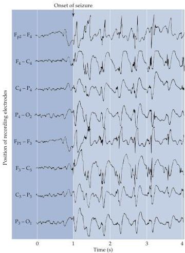

Plasticity of Mature Synapses and Circuits 601

Electroencephalogram (EEG) recorded from a patient during a seizure.
The traces show rhythmic activity that persisted much longer than the duration of this record.
This abnormal pattern reflects the synchronous firing of large numbers of cortical neurons.
(The designations are various positions of electrodes on the head; see Box C in Chapter 27 for additional information about EEG recordings.) (After Dyro, 1989.)

No effective prevention or cure exists for epilepsy.
Pharmacological therapies that successfully inhibit seizures are based on two general strategies.
One approach is to enhance the function of inhibitory synapses that use the neurotransmitter GABA; the other is to limit action potential firing by acting on voltage-gated Na⁺ channels.
Commonly used antiseizure medications include carbamazepine, phenobarbital, phenytoin (Dilantin®), and valproic acid.
These agents, which must be taken daily, successfully inhibit seizures in 60–70% of patients.
In a small fraction of patients, the epileptogenic region can be surgically excised.
In extreme cases, physicians resort to cutting the corpus callosum to prevent the spread of seizures (most of the "split-brain" subjects described in Chapter 26 were patients suffering from intractable epilepsy).
One of the major reasons for controlling epileptic activity is to prevent the more permanent plastic changes that would ensue as a consequence of abnormal and excessive neural activity.

## References

SCHEFFER, I.
E.
AND S.
F.
BERKOVIC (2003) The genetics of human epilepsy.
Trends Pharm.
Sci.
24: 428–433.
ENGEL, J.
JR.
AND T.
A.
PEDLEY (1997) Epilepsy: A Comprehensive Textbook.
Philadelphia: Lippincott-Raven Publishers.
McNamara, J.
O.
(1999) Emerging insights into the genesis of epilepsy.
Nature 399: A15–A22.

by electrophysiological mapping can expand at the expense of the other digits (Figure 24.16).
In fact, significant changes in receptive fields of somatic sensory neurons can be detected when a peripheral nerve is blocked temporarily by a local anesthetic.
The transient loss of sensory input from a small area of skin induces a reversible reorganization of the receptive fields of both cortical and subcortical neurons.
During this period, the neurons assume new receptive fields that respond to tactile stimulation of the skin surrounding the anesthetized region.
Once the effects of the local anesthetic subside, the receptive fields of cortical and subcortical neurons return to their usual size.
The common experience of an anesthetized area of skin feel