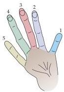
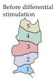
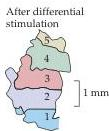

Chapter Twenty-Four

Figure 24.16 Functional expansion of a cortical representation by a repetitive behavioral task.
An owl monkey was trained in a task that required heavy usage of digits 2, 3, and occasionally 4.
The map of the digits in the primary somatic sensory cortex prior to training is shown.
After several months of "practice," a larger region of the cortex contained neurons activated by the digits used in the task.
Note that the specific arrangements of the digit representations are somewhat different from the monkey shown in Figure 24.14, indicating the variability of the cortical representation in particular animals.
(After Jenkins et al., 1990.)

ing disproportionately large—following dental anesthesia—may be a consequence of this temporary change.

Despite these intriguing observations, the mechanism, purpose, and significance of the reorganization of sensory and motor maps that occurs in adult cortex are not known.
Clearly, limited changes in cortical circuitry can occur in the adult brain, even though the basic features of cortical organization—such as ocular dominance columns and the broader topographical organization of inputs from the thalamus—remain fixed (see Chapter 23).
If a greater degree of cortical plasticity were possible, recovery from brain injury would be far more vigorous and effective than centuries of clinical observation have shown it to be.
Given their rapid and reversible character, most of these changes in cortical function probably reflect alterations in the strength of synapses already present.

## Recovery from Neural Injury

These various observations on adult plasticity indicate that normal experience can alter the strength of existing synapses and even elicit some local remodeling of synapses and circuits.
More extensive growth and remodeling are stimulated by nervous system injury.
As just noted, however, this remodeling rarely results in full restoration of lost function.

Traumatic injury, interruption of blood supply, and degenerative diseases all can damage axons in peripheral nerves, or neuronal cell bodies and syn

Figure 24.17 Different responses to injury in the peripheral (A) and central (B) nervous systems.
Damage to a peripheral nerve leads to series of cellular responses, collectively called Wallerian degeneration (after Augustus Waller, the nineteenth century English physician who first described these phenomena).
Distal to the site of injury, axons disconnected from their cell bodies degenerate, and invading macrophages remove the cellular debris.
Schwann cells that formerly ensheathed the axons proliferate, align to form longitudinal arrays, and increase their production of neurotrophic factors that can promote axon regeneration.
Schwann cell surfaces and the extracellular matrix also provide a favorable substratum for the extension of regenerating axons.
In the CNS, the removal of myelin debris is relatively slow, and the myelin membranes produce inhibitory molecules that can block axon growth (see Chapter 23).
Astrocytes at the site of injury also interfere with regeneration.
Proximal to the injury, neuron cell bodies react to peripheral nerve injury by inducing expression of growth-related genes, including those for major components of axonal growth cones.
Following CNS injury, however, neurons typically fail to activate these growth-associated genes.