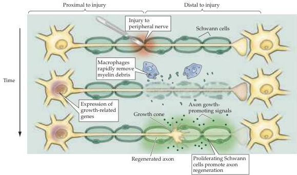
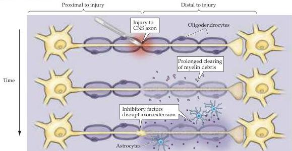

Plasticity of Mature Synapses and Circuits 603

apses in the more complex circuitry of the brain or spinal cord.
When peripheral nerves are injured, the damaged axons regenerate vigorously and can re-grow over distances of many centimeters or more.
Under favorable circumstances, these regenerated axons can also reestablish synaptic connections with their targets in the periphery.
In contrast, CNS axons typically fail to regenerate (Figure 24.17).
As a result, axonal damage in the retina, spinal cord, or the rest of the brain leads to permanent blindness, paralysis, and other disabilities.
What, then, explains this difference in the regeneration of

(A) Peripheral nervous system

(B) Central nervous system