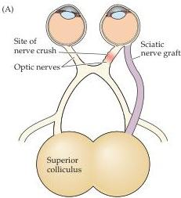
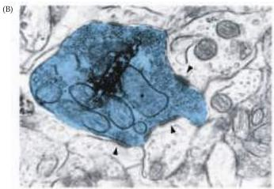

Plasticity of Mature Synapses and Circuits 607

Implantation of a section of peripheral nerve into the central nervous system facilitates the extension of central axons.
(A) Mammalian retinal ganglion neurons, which do not normally regenerate following a crush injury, will grow for many millimeters into a graft derived from the sciatic nerve.
(B) If the distal end of the graft is inserted into a normal target of retinal ganglion cells, such as the superior colliculus, a few regenerating axons invade the target and form functional synapses, as shown in this electron micrograph (arrowheads).
The dark material is an intracellularly transported label that identifies particular synaptic terminals as originating from a regenerated retinal axon.
(A after So and Aguayo, 1985; B from Bray et al., 1991.)

At present there is only one modestly helpful treatment for CNS injuries such as spinal cord transection.
High doses of a steroid, methylprednisolone, immediately after the injury prevents some of the secondary damage to neurons resulting from the initial trauma.
Although it may never be possible to fully restore function after such injuries, enhancing axon regeneration, blocking inhibitory

molecules and providing additional trophic support to surviving neurons could in principle allow sufficient recovery of motor control to give afflicted individuals a better quality of life than they now enjoy.
The best "treatment," however, is to prevent such injuries from occurring, since there is now very little that can be done after the fact.

## References

BRAY, G.
M., M.
P.
VILLEGAS-PEREZ, M.
VIDAL-SANZ AND A.
J.
AGUAYO (1987) The use of peripheral nerve grafts to enhance neuronal survival, promote growth and permit terminal reconnections in the central nervous system of adult rats.
J.
Exp.
Biol.
132: 5-19.

SCHNELL, L.
AND M.
E.
SCHWAB (1990) Axonal regeneration in the rat spinal cord produced by an antibody against myelin-associated neurite growth inhibitors.
Nature 343: 269-272.

SO, K.
F.
AND A.
J.
AGUAYO (1985) Lengthy regrowth of cut axons from ganglion cells after peripheral nerve transplantation into the retina of adult rats.
Brain Res.
359: 402-406.

VIDAL-SANZ, M., G.
M.
BRAY, M.
P.
VILLEGAS-PEREZ, S.
THANOS AND A.
J.
AGUAYO (1987) Axonal regeneration and synapse formation in the superior colliculus by retinal ganglion cells in the adult rat.
J.
Neurosci.
7: 2894-2909.

duces neurons during development) retains some neural stem cells in the adult.
The term "stem cells" refers to a population of cells that are self-renewing—each cell can divide symmetrically to give rise to more cells like itself, but also can divide asymmetrically, giving rise to a new stem cell plus one or more differentiated cells.
Thus a neural stem cell can give rise to the full complement of basic cell classes found in neural tissue—i.e., neurons, astrocytes, and oligodendroglia (see Box A in Chapter 21), as well as more stem cells.
Adult stem cells can be isolated not only from the anterior subventricular zone (near the olfactory bulb) and dentate gyrus, but from many other parts of the forebrain, cerebellum, midbrain, and spinal cord, although they do not apparently produce any new neurons in these sites.