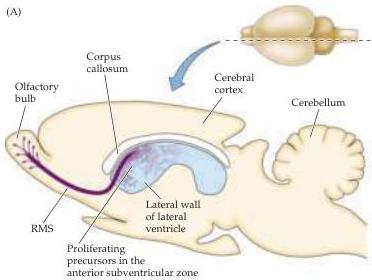
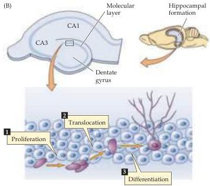

Chapter Twenty-Four

Figure 24.18 Neurogenesis in the adult mammalian brain.
(A) Neural precursors in the epithelial lining of the anterior lateral ventricles in the forebrain (a region called the anterior subventricular zone, or SVZ) give rise to postmitotic neuroblasts that migrate to the olfactory bulb via a distinctive pathway known as the rostral migratory stream or RMS.
Neuroblasts that migrate to the bulb via the RMS become either olfactory bulb granule cells or periglomerular cells; both cell types function as interneurons in the bulb.
(B) In the mature hippocampus, a population of neural precursors is resident in the basal aspect of the granule cell layer of the dentate gyrus.
These precursors give rise to postmitotic neuroblasts that translocate from the basal aspect of the granule cell layer to more apical levels.
In addition, some of these neuroblasts elaborate dendrites and a local axonal process and apparently become GABAergic interneurons within the dentate gyrus.
(After Gage, 2000.)

Why the generation of neurons is so restricted in the adult brain is not understood.
Nevertheless, the fact that new neurons can be generated in at least a few regions of the adult brain shows that this phenomenon can occur in the adult CNS.
The ability of newly generated neurons to integrate into some synaptic circuits adds to the available mechanisms for plasticity in the adult brain.
Thus, many investigators have begun to explore the potential use of stem cells for the repair of circuits damaged by traumatic injury or degenerative disease.