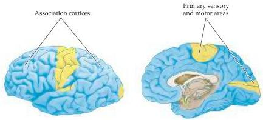

Chapter Twenty-Five

Figure 25.1 Lateral and medial views of the human brain, showing the extent of the association cortices in blue.
The primary sensory and motor regions of the neocortex are shaded in yellow.
Notice that the primary cortices occupy a relatively small fraction of the total area of the cortical mantle.
The remainder of the neocortex—defined by exclusion as the association cortices—is the seat of human cognitive ability.
The term association refers to the fact that these regions of the cortex integrate (associate) information derived from other brain regions.

tices in the parietal, temporal, and frontal lobes that make cognition possible.
(The extrastriate cortex of the occipital lobe is equally important in cognition; its functions, however, are largely concerned with vision, and much of what is known about these areas has been discussed in Chapter 11.) These other areas of the cerebral cortex are referred to collectively as the association cortices (see Figure 25.1).

## An Overview of Cortical Structure

Before delving into a more detailed account of the functions of these cortical regions, it is important to have a general understanding of cortical structure and the organization of its canonical circuitry.
Most of the cortex that covers the cerebral hemispheres is neocortex, defined as cortex that has six cellular layers, or laminae.
Each layer comprises more or less distinctive populations of cells based on their different densities, sizes, shapes, inputs, and outputs.
The laminar organization and basic connectivity of the human cerebral cortex are summarized in Figure 25.2A and Table 25.1.
Despite an overall uniformity, regional differences based on these laminar features have long been apparent (Box A), allowing investigators to identify numerous subdivisions of the cerebral cortex (Figure 25.2B).
These histologically defined subdivisions are referred to as cytoarchitectonic areas, and, over the years, a zealous band of neuroanatomists has painstakingly mapped these areas in humans and in some of the more widely used laboratory animals.

Early in the twentieth century, cytoarchitectonically distinct regions were identified with little or no knowledge of their functional significance.
Eventually, however, studies of patients in whom one or more of these cortical

TABLE 25.1 The Major Connections of the Neocortex

|  Sources of cortical input | Targets of cortical output  |
| --- | --- |
|  Other cortical regions | Other cortical regions  |
|  Hippocampal formation | Hippocampal formation  |
|  Amygdala | Amygdala  |
|  Thalamus | Thalamus  |
|  Brainstem modulatory systems | Caudate and putamen (striatum)  |
|   |  Brainstem  |
|   |  Spinal cord  |