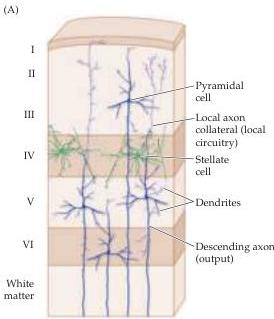
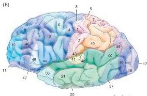
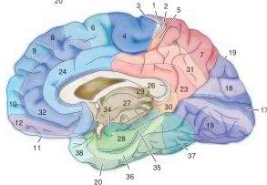

The Association Cortices 615

Figure 25.2 The structure of the human neocortex, including the association cortices.
(A) A summary of the cellular composition of the six layers of the neocortex.
(B) Based on variations in the thickness, cell density, and other histological features of the six neocortical laminae, the human brain can be divided into numerous cytoarchitectonic areas, in this case those recognized by the neuroanatomist Korbinian Brodmann in his seminal monograph in 1909.
(See Box A for additional details.)

areas had been damaged, supplemented by electrophysiological mapping in both laboratory animals and neurosurgical patients, supplied this information.
This work showed that many of the regions neuroanatomists had distinguished on histological grounds are also functionally distinct.
Thus, cytoarchitectonic areas can sometimes be identified by the physiological response properties of their constituent cells, and often by their patterns of local and long-distance connections.

Despite significant variations among different cytoarchitectonic areas, the circuitry of all cortical regions has some common features (Figure 25.3).
First, each cortical layer has a primary source of inputs and a primary output target.
Second, each area has connections in the vertical axis (called columnar or radial connections) and connections in the horizontal axis (called lateral or horizontal connections).
Third, cells with similar functions tend to be arrayed in radially aligned groups that span all of the cortical layers and receive inputs that are often segregated into radial or columnar bands.
Finally, interneurons within specific cortical layers give rise to extensive local axons that extend horizontally in the cortex, often linking functionally similar groups of cells.
The particular circuitry of any cortical region is a variation on this canonical pattern of inputs, outputs, and vertical and horizontal patterns of connectivity.

## Specific Features of the Association Cortices

These generalizations notwithstanding, the connectivity of the association cortices is appreciably different from primary and secondary sensory and motor cortices, particularly with respect to inputs and outputs.
For instance, two thalamic nuclei that are not involved in relaying primary motor or sensory information provide much of the subcortical input to the association