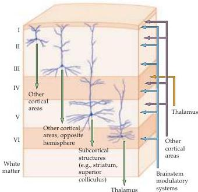

Chapter Twenty-Five

Figure 25.3 Canonical neocortical circuitry.
Green arrows indicate outputs to the major targets of each of the neocortical layers in humans; orange arrow indicates thalamic input (primarily to layer IV); purple arrows indicate input from other cortical areas; and blue arrows indicate input from the brainstem modulatory systems to each layer.

cortices: the pulvinar projects to the parietal association cortex, while the medial dorsal nuclei project to the frontal association cortex.
Several other thalamic nuclei, including the anterior and ventral anterior nuclei, innervate the association cortices as well.

Unlike the thalamic nuclei that receive peripheral sensory information and project to primary sensory cortices, the input to these association cortex-projecting nuclei comes from other regions of the cortex.
In consequence, the signals coming into the association cortices via the thalamus reflect sensory and motor information that has already been processed in the primary sensory and motor areas of the cerebral cortex, and is being fed back to the association regions.
The primary sensory cortices, in contrast, receive thalamic information that is more directly related to peripheral sense organs (see, for example, Chapter 8).
Similarly, much of the thalamic input to primary motor cortex is derived from the thalamic nuclei related to the basal ganglia and cerebellum rather than to other cortical regions (see Unit III).

A second major difference in the sources of innervation to the association cortices is their enrichment in direct projections from other cortical areas, called corticocortical connections (see Figure 25.3).
Indeed, these connections form the majority of the input to the association cortices.
Ipsilateral corticocortical connections arise from primary and secondary sensory and motor cortices, and from other association cortices within the same hemisphere.
Corticocortical connections also arise from both corresponding and noncorresponding cortical regions in the opposite hemisphere via the corpus callosum and anterior commissure, which together are referred to as interhemispheric connections.
In the association cortices of humans and other primates, corticocortical connections often form segregated bands or columns in which interhemispheric projection bands are interdigitated with bands of ipsilateral corticocortical projections.

Another important source of innervation to the association areas is subcortical, arising from the dopaminergic nuclei in the midbrain, the noradren-