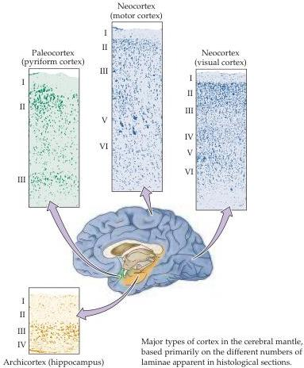

The Association Cortices 617

# Box A

## A More Detailed Look at Cortical Lamination

Much knowledge about the cerebral cortex is based on descriptions of differences in cell number and density throughout the cortical mantle.
Nerve cell bodies, because of their high metabolic rate, are rich in basophilic substances (RNA, for instance), and therefore tend to stain darkly with reagents such as cresyl violet acetate.
These Nissl stains (named after F.
Nissl, who first described this technique when he was a medical student in nineteenth-century Germany) provide a dramatic picture of brain structure at the histological level.
The most striking feature revealed in this way is the distinctive lamination of the cortex in humans and other mammals, as seen in the figure.
In humans, there are three to six cortical layers, which are usually designated by roman numerals, with letters for laminar subdivisions (layers IVa, IVb, and IVc in the visual cortex, for example).

Each of the cortical laminae in the so-called neocortex (which covers the bulk of the cerebral hemispheres and is defined by six layers) has characteristic functional and anatomical features (see Figures 25.2 and 25.3).
For example, cortical layer IV is typically rich in stellate neurons with locally ramifying axons; in the primary sensory cortices, these neurons receive input from the thalamus, the major sensory relay from the periphery.
Layer V, and to a lesser degree layer VI, contain pyramidal neurons whose axons typically leave the cortex.
The generally smaller pyramidal neurons in layers II and III (which are not as distinct as their roman numeral assignments suggest) have primarily corticocortical connections, and layer I contains mainly neuropil.
Korbinian Brodmann, who early in the twentieth century devoted his career to an analysis of brain regions distinguished in this way, described about 50 distinct cortical regions, or cytoarchitectonic areas (see Figure 25.2B).
These structural features of the cerebral cortex continue to figure importantly in discussions of the brain, particularly in structural/functional correlation of intensely studied regions such as the primary sensory and motor cortices.

Not all of the cortical mantle is six-layered neocortex.
The hippocampus, for example, which lies deep in the temporal lobe and has been implicated in acquisition of declarative memories (see Chapter 30), has only three or four laminae.
The hippocampal cortex is regarded as evolutionarily more primitive, and is therefore called archicortex to distinguish it from the six-layered neocortex.
Another, presumably more primitive, type of cortex, called paleocortex (paleo = ancient), generally has three layers and is found on the ventral surface of the cerebral hemispheres and along the parahippocampal gyrus in the medial temporal lobe.

The functional significance of different numbers of laminae in neocortex, archicortex, and paleocortex is not known, although it seems likely that the greater number of layers in neocortex reflects more complex information processing than in archi- or paleocortex.
The general similarity of neocortical structure across the entire cerebrum clearly suggests that there is a common denominator of cortical operation, although no one has yet deciphered what it is.

