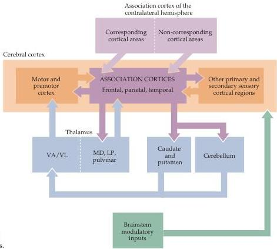

Chapter Twenty-Five

ergic and serotonergic nuclei in the brainstem reticular formation, and cholinergic nuclei in the brainstem and basal forebrain.
These diffuse inputs project to different cortical layers and, among other functions, determine mental state along a continuum that ranges from deep sleep to high alert (see Chapter 27).

The general wiring plan for the association cortices is summarized in Figure 25.4.
Despite this degree of interconnectivity, the extensive inputs and outputs of the association cortices should not be taken to imply that everything is simply connected to everything else in these regions.
On the contrary, each association cortex is defined by a distinct, if overlapping, subset of thalamic, corticocortical, and subcortical connections.
It is nonetheless difficult to conclude much about the role of these different cortical areas based solely on connectivity (this information is, in any event, quite limited for the human association cortices; most of the evidence comes from anatomical tracing studies in non-human primates, supplemented by the limited pathway tracing that can be done in human brain tissue postmortem).
As a result, inferences about the function of human association areas continue to depend critically on observations of patients with cortical lesions.
Damage to the association cortices in the parietal, temporal, and frontal lobes, respectively, results in specific cognitive deficits that indicate much about the operations and purposes of each of these regions.
These deductions have largely been corroborated by patterns of neural activity observed in the homologous regions of the brains of experimental animals, as well as in humans using noninvasive imaging techniques.

Figure 25.4 Summary of the overall connectivity of the association cortices.