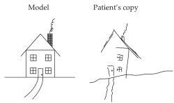
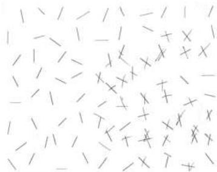

The Association Cortices 619

# Lesions of the Parietal Association Cortex: Deficits of Attention

In 1941, the British neurologist W.
R.
Brain reported three patients with unilateral parietal lobe lesions in whom the primary problem was varying degrees of attentional difficulty.
Brain described their peculiar deficiency in the following way:

Though not suffering from a loss of topographical memory or an inability to describe familiar routes, they nevertheless got lost in going from one room to another in their own homes, always making the same error of choosing a right turning instead of a left, or a door on the right instead of one on the left.
In each case there was a massive lesion in the right parieto-occipital region, and it is suggested that this ...
resulted in an inattention to or neglect of the left half of external space.

The patient who is thus cut off from the sensations which are necessary for the construction of a body scheme may react to the situation in several different ways.
He may remember that the limbs on his left side are still there, or he may periodically forget them until reminded of their presence.
He may have an illusion of their absence, i.e.
they may 'feel absent' although he knows that they are there; he may believe that they are absent but allow himself to be convinced by evidence to the contrary; or, finally, his belief in their absence may be unamenable to reason and evidence to the contrary and so constitute a delusion.

W.
R.
Brain, 1941 (Brain 64: pp.
257 and 264)

This description is generally considered the first account of the link between parietal lobe lesions and deficits in attention or perceptual awareness.
Based on a large number of patients studied since Brain's pioneering work, these deficits are now referred to as contralateral neglect syndrome.

The hallmark of contralateral neglect is an inability to attend to objects, or even one's own body, in a portion of space, despite the fact that visual acuity, somatic sensation, and motor ability remain intact.
Affected individuals fail to report, respond to, or even orient to stimuli presented to the side of the body (or visual space) opposite the lesion (Figure 25.5).
They may also have difficulty performing complex motor tasks on the neglected side, including

(A) "Draw a house"
(B) "Bisect the line"

(C) "Cancel the line"