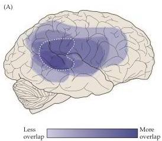
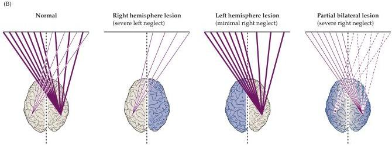

Chapter Twenty-Five

Figure 25.6 Neuroanatomy of attention.
(A) Composite of the location of the underlying lesions in eight patients diagnosed with contralateral neglect syndrome.
The site of damage was ascertained from CT scans (see Box B in Chapter 1).
While the lesions include parietal cortical areas, frontal areas, and the temporal lobe of the right hemisphere, the region of the right parietal lobe indicated by the dashed line is most often affected.
(B) Schematic illustration of hemispheric asymmetry in attention inferred from neglect patients.
In normal subjects, the right parietal cortex dominates the control of attention, as indicated by the thicker rays.
A right parietal lesion (purple) results in severe left neglect, whereas a left parietal lesion leads to only minimal right neglect due to preserved attention within the right hemisphere.
Bilateral parietal lesions cause right neglect due to a lack of attentive processing in both hemispheres.
(A after Heilman and Valenstein, 1985; B after Blumenfeld, 2002.)

dressing themselves, reaching for objects, writing, drawing, and, to a lesser extent, orienting to sounds (the motor deficits are called apraxias).
The signs of neglect can be as subtle as a temporary lack of contralateral attention that rapidly improves as the patient recovers, or as profound as permanent denial of the existence of the side of the body and extrapersonal space opposite the lesion.
Since Brain's original description of contralateral neglect and its relationship to lesions of the parietal lobe, it has been generally accepted that the parietal cortex, particularly the inferior parietal lobe, is the primary cortical region (but not the only region) governing attention (Figure 25.6A).

Importantly, contralateral neglect syndrome is specifically associated with damage to the right parietal cortex.
The unequal distribution of this particular cognitive function between the hemispheres is thought to arise because the right parietal cortex mediates attention to both left and right halves of the body and extrapersonal space, whereas the left hemisphere mediates attention primarily to the right (Figure 25.6B).
Thus, left parietal lesions tend to be compensated by the intact right hemisphere.
In contrast, when the right parietal cortex is damaged, there is little or no compensatory capacity in the left hemisphere to mediate attention to the left side of the body or extrapersonal space.