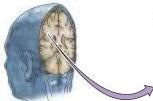
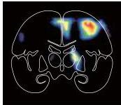
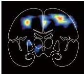

The Association Cortices 621

(A) Attending to the left visual field
L
R

(B) Attending to the right visual field
L
R
Figure 25.7 In confirmation of the impressions derived from neurological patients with parietal lobe damage, the right parietal cortex of normal subjects is highly active during tasks requiring attention.
(A) A subject has been asked to attend to objects in the left visual field; only the right parietal cortex is active.
(B) When attention is shifted from the left visual field to the right, the right parietal cortex remains active, but activity is apparent in the left parietal cortex as well.
This arrangement implies that damage to the left parietal lobe does not generate right-sided hemineglect because the right parietal lobe also serves this function.
(After Posner and Raichle, 1994.)

This interpretation has been confirmed by noninvasive imaging of parietal lobe activity during specific attention tasks carried out by normal subjects.
Such studies show that blood flow is increased in both the right and left parietal cortices when subjects are asked to perform tasks in the right visual field requiring selective attention to distinct aspects of a visual stimulus such as its shape, velocity, or color.
However, when a similar challenge is presented in the left visual field, only the right parietal cortex is activated (Figure 25.7).
There is also evidence of increased activity in the right frontal cortex during such tasks (see Figure 25.6A).
This latter observation suggests that regions outside the parietal lobe also contribute to attentive behavior, and perhaps to some aspects of the pathology of neglect syndromes.
Overall, however, metabolic mapping is consistent with the clinical fact that contralateral neglect typically arises from a right parietal lesion, and endorses the broader idea of hemispheric specialization for attention, in keeping with hemispheric specialization for a number of other cognitive functions (see below and Chapter 26).

Interestingly, patients with contralateral neglect are not simply deficient in their attentiveness to the left visual field, but to the left sides of objects generally.
For example, when asked to cross out lines distributed throughout the visual field, contralateral neglect patients, as expected, tend to bisect more lines on the right side of the field than on the left, consistent with a disruption in attentiveness to the left visual field (see Figure 25.5C).
The lines they draw, however, tend to be biased towards the right side of each nonvertical line, wherever the line happens to be in the visual field.
These observations suggest that attentiveness relies on a frame of reference anchored to the locations of objects and their relative dimensions.

Disruptions in spatial frames of reference are also associated with lesions of the parietal cortex that are more dorsal and medial than those typically associated with classical neglect.
Such damage often presents as a triad of visuospatial deficits known as Balint's syndrome (named after an Austrian-Hungarian neurologist).
These three signs are: an inability to perceive parts of a complex visual scene as a whole (called simultanagnosia); deficits in visually guided reaching (optic ataxia); and difficulty in voluntary scanning of visual scenes (ocular apraxia).
In contrast to classical neglect, optic ataxia and ocular apraxia typically remit when movements are guided by non-visual cues.
These observations suggest that the parietal cortex participates in the construction of spatial representations that can guide both attention and movement.