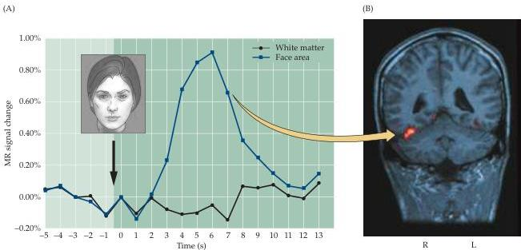

The Association Cortices

Figure 25.8 Functional brain imaging of temporal lobe during face recognition.
(A) Face stimulus presented to a normal subject at time indicated by arrow.
Graph shows activity change in the relevant area of the right temporal lobe.
(B) Location of fMRI activity in the right inferior temporal lobe.
(Courtesy of Greg McCarthy.)

The lesions that typically cause recognition deficits are in the inferior temporal cortex in or near the so-called fusiform gyrus; those that cause language-related problems in the left temporal lobe tend to be on the lateral surface of the cortex.
Consistent with these conclusions, direct cortical stimulation in subjects whose temporal lobes are being mapped for neurosurgery (typically removal of an epileptic focus) may have a transient prosopagnosia as a consequence of this abnormal activation of the relevant regions of the right temporal cortex.

Prosopagnosia and related agnosias involving objects are specific instances of a broad range of functional deficits that have as their hallmark the inability to recognize a complex sensory stimulus as familiar, and to identify and name that stimulus as a meaningful entity in the environment.
Depending on the laterality, location, and size of the lesion in temporal cortex, agnosias can be as specific as for human faces, or as general as an inability to name most familiar objects.

# Lesions of the Frontal Association Cortex: Deficits of Planning

The functional deficits that result from damage to the human frontal lobe are diverse and devastating, particularly if both hemispheres are involved.
This broad range of clinical effects stems from the fact that the frontal cortex has a wider repertoire of functions than any other neocortical region (consistent with the fact that the frontal lobe in humans and other primates is the largest of the brain's lobes and comprises a greater number of cytoarchitectonic areas).

The particularly devastating nature of the behavioral deficits after frontal lobe damage reflects the role of this part of the brain in maintaining what is normally thought of as an individual's "personality." The frontal cortex inte