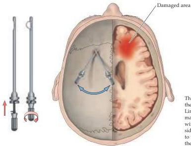

The Association Cortices 625

# Box B

## Psychosurgery

The consequences of frontal lobe destruction have been all too well documented by a disturbing yet fascinating episode in twentieth-century medical practice.
During the period from 1935 through the 1940s, neurosurgical destruction of the frontal lobe (frontal lobotomy or leukotomy) was a popular treatment for certain mental disorders.
More than 20,000 of these procedures were performed, mostly in the United States.

Enthusiasm for this approach to mental disease grew from the work of Egas Moniz, a respected Portuguese neurologist, who, among other accomplishments, did pioneering work on cerebral angiography before becoming the leading advocate of psychosurgery.
Moniz recognized that the frontal lobes were important in personality structure and behavior, and concluded that interfering with frontal lobe function might alter the course of mental diseases such as schizophrenia and other chronic psychiatric disorders.
He also recognized that destroying the frontal lobe would be relatively easy to do and, with the help of

Almeida Lima, a neurosurgical colleague, introduced a simple surgical procedure for indiscriminately destroying most of the connections between the frontal lobe and the rest of the brain (see figure).

In the United States, the neurologist Walter Freeman at George Washington University School of Medicine, in collaboration with neurosurgeon James Watts, became an equally strong advocate of this approach.
Freeman devoted his life to treating a wide variety of mentally disturbed patients in this way.
He popularized a form of the procedure that could be carried out under local anesthesia and traveled widely across the United States to demonstrate this technique and encourage its use.

Although it is easy in retrospect to be critical of this zealotry in the absence of either evidence or sound theory, it is important to remember that effective psychotropic drugs were not then available, and patients suffering from many of the disorders for which leukotomies were done were confined under custo

dial conditions that were at best dismal, and at worst brutal.
Rendering a patient relatively tractable, albeit permanently altered in personality, no doubt seemed the most humane of the difficult choices that faced psychiatrists and others dealing with such patients in that period.

With the advent of increasingly effective psychotropic drugs in the late 1940s and the early 1950s, frontal lobotomy as a psychotherapeutic strategy rapidly disappeared, but not before Moniz was awarded the Nobel Prize for Physiology or Medicine in 1949.
The history of this instructive episode in modern medicine has been compellingly told by Eliot Valenstein, and his book on the rise and fall of psychosurgery should be read by anyone contemplating a career in neurology, neurosurgery, or psychiatry.

## References

BRICKNER, R.
M.
(1932) An interpretation of function based on the study of a case of bilateral frontal lobectomy.
Proceedings of the Association for Research in Nervous and Mental Disorders 13: 259-351.
BRICKNER, R.
M.
(1952) Brain of patient A after bilateral frontal lobectomy: Status of frontal lobe problem.
Arch.
Neurol.
Psychiatry 68: 293-313.
FREEMAN, W.
AND J.
WATTS (1942) Psychosurgery: Intelligence, Emotion and Social Behavior Following Prefrontal Lobotomy for Mental Disorders.
Springfield, IL: Charles C.
Thomas.
MONIZ, E.
(1937) Prefrontal leukotomy in the treatment of mental disorders.
Am.
J.
Psychiatry 93: 1379-1385
VALENSTEIN, E.
S.
(1986) Great and Desperate Cures: The Rise and Decline of Psychosurgery and Other Radical Treatments for Mental Illness.
New York: Basic Books.

The surgical technique for frontal leukotomy under local anesthesia described and advocated by Egas Moniz and Almeida Lima.
The "leukotome" was inserted into the brain at approximately the angles shown.
When the leukotome was in place, a wire "knife" was extended and the handle rotated.
The right side of the figure depicts a horizontal slice of the brain (parallel to the top of the skull) with Moniz's estimate of the extent of the damage done by the procedure.
(After Moniz, 1937.)