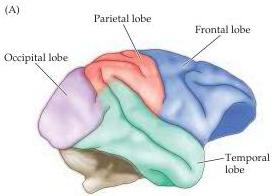
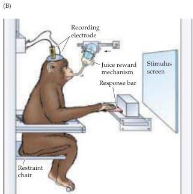

The Association Cortices

Figure 25.9 Recording from single neurons in the brain of an awake, behaving rhesus monkey.
(A) Lateral view of the rhesus monkey brain showing the parietal (red), temporal (green), and frontal (blue) cortices.
The occipital cortex is shaded purple.
(B) The animal is seated in a chair and gently restrained.
Several weeks before data collection begins, a recording well is placed through the skull using a sterile surgical technique.
For electrophysiological recording experiments, a tungsten microelectrode is inserted through the dura and arachnoid, and into the cortex.
The screen and the response bar in front of the monkey are for behavioral testing.
In this way, individual neurons can be monitored while the monkey performs specific cognitive tasks.

by changes in neuronal activity associated with simultaneous changes in the attentive behavior of the animal.
As might be expected from the clinical evidence in humans, neurons in specific regions of the parietal cortex of the rhesus monkey are activated when the animal attends to a target but not when the same stimulus is ignored (Figure 25.10B).

In another study, monkeys were rewarded with different amounts of fruit juice (a highly desirable treat) for attending to each of a pair of simultaneously illuminated targets (Figure 25.10C).
Not surprisingly, the frequency with which monkeys attended to each target varied with the amount of juice they could expect for doing so.
Moreover, the activity of some neurons in parietal cortex also varied systematically as a function of the amount of juice associated with each target, and therefore the amount of attention paid by the monkey to the target.
Thus, the primate parietal cortex contains neurons that respond specifically when the animal attends to a behaviorally meaningful stimulus, and the vigor of the response reflects the amount of attention paid to the stimulus.

# "Recognition Neurons" in the Monkey Temporal Cortex

In keeping with human deficits of recognition following temporal lobe lesions, neurons with responses that correlate with the recognition of specific